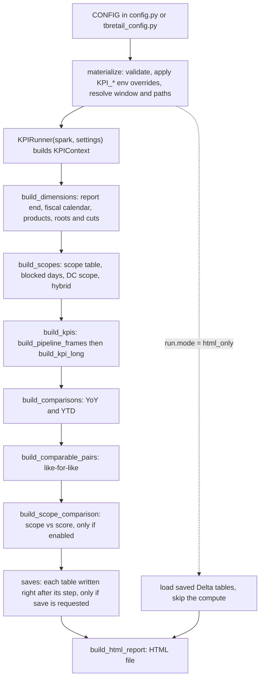

# Logic flow

This page explains how the pipeline turns source tables into the KPI numbers. It is written for analysts and engineers who need to explain a number. Every rule cites the code as `file:line`. The code is the source of truth. [CONFIG.md](CONFIG.md) has the full config reference, [METRICS.md](METRICS.md) the metric definitions, [OUTPUTS.md](OUTPUTS.md) the saved tables, and [Part 3](#part-3---detailed-rules-and-reference) the detailed scope, root, comparable-pair and reporting-window rules.

Part 1 describes the generic pipeline (`config.py`). Part 2 gives the actual values of `tbretail_config.py`. The last section lists every filter and removal in one table.

Short vocabulary:

- **Pair**: a product and store combination.
- **Frame**: a Spark table that metrics are computed from (`scoped_daily`, `inst_data`, `lost_base`, `dc_daily`, `dc_inst`).
- **Root**: a population tab (`overall`, plus one per dimension-source value such as `nvrout`).
- **Cut**: a breakdown inside a root (for example `brand`).
- **GIT**: goods in transit.
- **Blocked day**: a day a pair is blocked in the UI blocked scope.



---

# Part 1 - General flow (`config.py`)

## 1. Config to settings and the reporting window

`CONFIG` is the only part you edit (`config.py:64`). `materialize()` (`config.py:577`) does five things:

1. Applies optional `KPI_*` environment overrides (`config.py:380-449`). `KPI_BUCKET` overrides the datastore bucket (`config.py:587`).
2. Builds every source path under the bucket `/mnt/invent-{customer}-datastore` from `path_segments` (`config.py:587-602`).
3. Validates the config and raises on bad combinations (`config.py:620-886`).
4. Resolves the reporting window (below).
5. Returns the flat `settings` dict that `KPIRunner` reads (`config.py:1014-1084`).

Switches that `materialize()` enforces:

| Config key | Rule | Line |
|---|---|---|
| `instock.method` | must be `daily`, `weekly_source` or `lost_sales_source` | `config.py:620` |
| `sales_basis` | must be `net` or `gross` | `config.py:665-667` |
| `reporting_window.report_end` | must be `as_of`, `complete_month` or `latest_day` | `config.py:680` |
| `reporting_window.report_end = "latest_day"` | needs `instock.method = "daily"` | `config.py:851` |
| `scope.time`, `scope.grain`, `scope.columns` | `time` is `daily` or `weekly`, `grain` is `product` or `product_store`; `product` and (for `product_store`) `store` columns are required; `weekly` needs `date` or `year` + `week` and no `start` / `end`; `daily` takes no `date` / `year` / `week` | `config.py:747-760` |
| `instock.method = "daily"` | needs a store grain, no `lost_sales_ensemble`, and a valid `count_start` | `config.py:820-841` |
| `scope.columns.solution` | needs `scope.solution_id` | `config.py:762` |
| `blocked_scope.ui_parameters_path` | needs `scope.columns.start` and `scope.columns.store` | `config.py:781` |
| `blocked_scope.dc_solution_id` | needs `scope.dc_solution_id` | `config.py:808` |
| `scope.dc_solution_id` | needs `scope.columns.solution`, `start` and `store` | `config.py:766` |
| `scope.instock_main_eligible_only` | needs `scope.columns.start`, `roll_to_family_main`, method `daily` | `config.py:842-848` |
| `scope.instock_exclude_unsuperseded_sizes` | needs method `daily` | `config.py:850` |
| `goods_in_transit.store_instock` | needs method `daily` | `config.py:884` |
| `goods_in_transit.inventory_metrics` | needs `use_fiscal_calendar = True`; needs `date_shift_days` set | `config.py:876-886` |
| `lost_sales_ensemble.enabled` | cannot combine with `weekly_source` or `daily` | `config.py:692-698`, `config.py:834` |
| `comparable_pairs.kinds` has `half` | needs `fiscal_calendar.half_periods = True` | `config.py:963-964` |

### Reporting window

Dates come from `_resolve_report_window` (`config.py:543-571`). All weeks run Sunday to Saturday.

| Setting | Rule | Config key |
|---|---|---|
| `REPORT_START_DATE` | the Sunday of the week that contains Jan 1 of the `as_of_date` year | `reporting_window.as_of_date` |
| `RUN_MIN_DATE` | the Sunday of the week containing `run_min_date`; must be on or before the report end | `reporting_window.run_min_date` |
| `EFFECTIVE_REPORT_START_DATE` | `RUN_MIN_DATE` if set, else `REPORT_START_DATE` | `reporting_window.run_min_date` |
| `REPORT_END_DATE` | `latest_day`: `as_of_date` itself. `as_of` and `complete_month`: the last completed Saturday on or before `as_of_date` | `reporting_window.report_end` |
| `RUN_WEEK_START_DATE` / `RUN_WEEK_END_DATE` | Sunday and Saturday of the `as_of_date` week | `reporting_window.as_of_date` |

Report-end modes:

- **`as_of`**: the window ends on the last complete Sunday-Saturday week. The Annual tab keeps partial years. YTD uses the fiscal months that are fully elapsed in the latest year, for every year (`fiscal.py:114-122`, `kpi_long.py:133-139`).
- **`complete_month`**: after the first step, `apply_report_end_mode` cuts `REPORT_END_DATE` back to the last day of the most recent fully elapsed month (`fiscal.py:228-272`). On the fiscal calendar the month bounds come from the unclipped upload, which must extend past the end date (`fiscal.py:242-247`). On the civil calendar the cut is the previous month end and is usually mid-week (`fiscal.py:221-226`). It raises if no month ends inside the window or the cut month starts before the window (`fiscal.py:260-270`).
- **`latest_day`**: the window ends on `as_of_date` itself. YTD covers fiscal days 1..K of every year, where K is the fiscal day number of the end date (`fiscal.py:275-332`). The other tabs show complete periods only. Lost sales stops at the last Saturday (see section 5).

`as_of_date` is also the default `output.run_date` (`config.py:968-973`).

## 2. Run order

`KPIRunner.run()` (`runner.py:300-327`) runs these stages in order. In `html_only` mode it runs only `run_html_only` (`runner.py:288-298`). The notebook (`main.ipynb`) calls `run(save=True)`: with `output.save_outputs` on, each table is written as soon as its stage builds it (section 8), so an interrupted run keeps every table it finished.

**Progress.** Once the scopes are built, `run()` plans the KPI tables of every stage (`runner.py:329-343`): kpi_long = one per period type, comparable = `comparable.PLANNED_BUILDS` per kind (ytd / yoy 1, quarter 4, half 2), scope_diff = 2. Each KPI table is one `metrics.build_kpi_table` call (one `toPandas`, the run's main cost) that covers every root × cut of that period type or comparable build. It prints `PLAN: N KPI tables (...)`, a header per stage, and one line per table, for example `[kpi_long 1/6 | run 1/11] annual · 3 roots x 3 cuts — took | elapsed | ~left` (`runner.py:79-152`, ticked in `kpi_long.kpi_rows` and `comparisons.build_scope_diff`). A comparable build that is skipped (fewer than 2 qualifying years, no common pair, a quarter / half number without data) is dropped from the plan with a printed line. The time left is the average per table so far, so it is rough; the first kpi_long table also pays for materializing the cached frames.

| # | Stage | Reads | Sets on `ctx` | Prints / displays |
|---|---|---|---|---|
| 0 | `materialize` | `CONFIG`, env | nothing (returns `settings`) | nothing |
| 1 | `print_config_summary` (notebook Cell 1, `runner.py:192-249`) | `settings` | nothing | customer, as-of date, window, fiscal flag, sales basis, scope mode, instock method, GIT, slices, comparisons, save plan settings |
| 2 | `_reset_run_caches` (`runner.py:176-190`) | nothing | unpersists, then clears `daily_data_raw`, `daily_data_excluded_days`, `lost_sales_weekly_base`, `instock_weekly_base`, `item_family_raw`, `inventory_warehouse_rolled` | nothing |
| 3 | `build_dimensions` (`runner.py:374-376`) | fiscal_cal upload (or daily-data on the civil calendar), products table, dimension sources | `fiscal_cal`, `fiscal_week`, `products_attr`, `product_dims`, `active_slice_dimensions`, `cut_dimensions`, `root_definitions`, `complete_fiscal_periods`; `available_fiscal_months` (not `latest_day`); `ytd_through_day`, `ytd_years`, `day_calendar`, `ytd_lost_sales_last_week` (`latest_day` only). It can also change `settings["REPORT_END_DATE"]` (`complete_month`). | `report_end=complete_month: ...` cut line, `time grain`, `fiscal weeks`, fully elapsed months, latest complete period per tab, `ROOTS`, `CUT_DIMENSIONS`, `ACTIVE_SLICE_DIMENSIONS`, dimension-source join lines, `latest_day` YTD line (`fiscal.py:327-332`, `fiscal.py:562-575`, `fiscal.py:634-652`) |
| 4 | `build_scopes` (`runner.py:378-384`) | the scope table, item_family, products, blocked-scope parquet, daily-data (score scope) | `scope_keys`, `scope_table_keys`, `scope_pairs`, `blocked_days`, `dc_scope_pairs`, `dc_blocked_days`, `score_only_scope_keys`, `hybrid_scope_keys` | scope pair counts, blocked pair-days, DC scope pairs, scope mode and final scope size (`scope.py:145`, `scope.py:198`, `scope.py:217-220`, `scope.py:316`, `scope.py:330`, `scope.py:440-441`, `scope.py:454-456`) |
| 5 | `build_kpis` (`runner.py:396-408`) | all frame sources (section 3) | `hybrid_frames`, `kpi_long` | `kpi_long shape`, slices, periods, then a table of the overall latest period of each period type |
| 6 | `build_comparisons` (`runner.py:410-415`) | `kpi_long` | `comparison_yoy`, `comparison_ytd`, `yoy_display`, `ytd_display`, `kpi_long_display` (trimmed copy for HTML) | one table per selected kind (overall root and cut) |
| 7 | `build_comparable_pairs` (`runner.py:417-424`) | `hybrid_frames` | `comparable_kpi_long`, `comparable_comparison_<kind>`, `comparable_<kind>_display` | one table per enabled kind (latest link, overall) |
| 8 | `build_scope_comparison` (`runner.py:426-441`) | rebuilds frames for the scope table and the score scope | `scope_frames`, `score_frames`, `scope_diff` | `scope diff: skipped` when `scope.run_scope_diff` is off |
| 9 | save, right after each of stages 5-8 (`OutputSaver`, `io.py:596-693`) | the table that stage built | `save_plan` (each written table's counts) | `Saving outputs` header before the run, then `saved <table>` lines (`io.py:467-470`) |
| 10 | `build_html_report` (`runner.py:443-476`) | `kpi_long_display` and comparison tables | nothing | `HTML report written: ...` (`html_report.py:1849`); with `html_report.output_path_segments` set it also writes a copy to the datastore (`runner.py:464-474`) |

Notebook cells around the runner (`main.ipynb`):

- **Cell 2** previews scope, lost-sales and daily-data inputs with the same `input_filters`. It is read-only.
- **Scope debug cell** runs `prepare_scopes` (reset caches, `build_dimensions`, `build_scopes`), then displays distinct product, store and pair counts overall and per slice (`runner.py:478-481`, `scope_debug.py:18-117`). The next `run()` reuses that scope instead of building it again (`runner.py:305-307`, `runner.py:366-372`).
- **Cell 3** binds `ctx = runner.ctx` first (so the later cells see what an interrupted run built), then runs `runner.run(save=True)`: progress lines per KPI table, and each table saved as soon as it is built.
- **Scope summary cell** displays row counts by `scope_origin` in the final scope (`runner.py:483-484`, `scope.py:462-472`).
- **Cell 4** prints what Cell 3 wrote (`ctx.save_plan`). **Cell 5** re-saves every built table with `save_outputs` only when `RESAVE = True` (after `save=False`, after finishing a step an interrupted Cell 3 did not reach, or after changing `allow_overwrite_existing`).
- **Cell 6** builds the HTML report.
- Remaining cells display samples of `kpi_long`, comparisons, comparable pairs and the scope diff.

`html_only` mode applies the report-end mode, loads the saved tables, infers roots and cuts from the saved `kpi_long`, loads the fiscal weeks and trims the display copy (`runner.py:288-298`).

## 3. Data sources

Every Delta read goes through the functions in `inputs.py`. `input_filters.<source>` is a list of Spark SQL expressions applied to that source (`inputs.py:47-55`). A filter listed twice is applied twice.

| Source | Config key | Columns used | Filters and windows | Roll-up |
|---|---|---|---|---|
| Fiscal calendar upload | `path_segments.fiscal` | `date`, `Year`, `Week`, plus the `column_map` quarter, month and month-name columns | clipped to the window for `fiscal_cal`; unclipped when period bounds are needed (`fiscal.py:93-111`) | none |
| Daily data | `path_segments.daily_data` | `product_id`, `store_id`, date column, `sales_revenue`, `sales_quantity`, `inventory`; the week column on the civil calendar only (`inputs.py:295-296`) | `input_filters.daily_data`, then dates inside `[EFFECTIVE_REPORT_START_DATE, REPORT_END_DATE]` (`inputs.py:297-301`) | `item_family_rollup.daily_data` (default True) |
| Transactional sales (only with `sales_basis = "gross"`) | `path_segments.transactional_sales` | `product_id`, `store_id`, `date`, `sales_type`, `sales_revenue`, `sales_quantity` | window dates on the raw `date` column (file pruning), then `input_filters.transactional_sales` (default `sales_type != 'return'`); summed per product, store, date, then full-outer-joined onto the daily-data rows, a transactional day without one becoming a sales-only row (`inputs._gross_sales_by_day`, `inputs._with_gross_sales`) | `item_family_rollup.transactional_sales` (default True, must equal `daily_data`), before the sum |
| Daily data, removed days | same table | `product_id`, `store_id`, date | the days `input_filters.daily_data` removes, window days only; empty without filters (`inputs.py:311-338`) | same roll-up |
| Daily data, in-stock copy | same table | `product_id`, `store_id`, date, `inventory`, `usable` (null counts as unusable) | no `input_filters`; dates from `instock.daily.history_start` (else window start) to the report end (`inputs.py:507-531`) | not rolled (already family-main) |
| Products | `path_segments.products` | `product_id`, `cogs`, `price_without_tax`, slice columns, `is_active`, `option_code` | `dropDuplicates(product_id)` (`fiscal.py:611-617`); active flag read separately (`inputs.py:452-458`) | none |
| Item family | `path_segments.item_family`, `item_family_source` | `product_id`, `parent_id`, `is_main` | `input_filters.item_family` (`inputs.py:355-369`) | the map itself |
| Scope table | `path_segments.scope`, `scope.columns` | the configured product, store, start, end, solution, run-date and (weekly) date / year / week columns | `input_filters.scope`, then `solution_id` in the list (`columns.solution`), `run_date` equal to the scope run date (`columns.run_date`), `end_date` null or on or after it (`columns.end`); fails when a solution / run-date filter leaves no row (`inputs.py:401-449`) | `scope.roll_to_family_main` |
| Inventory warehouse (DC) | `path_segments.inventory_warehouse` | `product_id`, `warehouse_id`, `date`, `inventory` | `input_filters.inventory_warehouse`, then window dates (`pipeline.py:605-627`) | `item_family_rollup.inventory_warehouse` (default True), then re-summed per product, warehouse, date |
| Goods in transit | `path_segments.goods_in_transit`, `goods_in_transit` | `product_id`, `destination_id`, `destination_type`, `date`, `quantity` | `quantity > 0`; `destination_type` 0 = store, 1 = warehouse; dates shifted by `date_shift_days` (`pipeline.py:564-586`) | `goods_in_transit.roll_to_family_main` |
| Lost sales | `path_segments.lost_sales`, `lost_sales_source` | week, product or planning-level, optional store, `lost_sales`; `in_stock` and `total_days` only for method `lost_sales_source` | `input_filters.lost_sales`, then window weeks (`pipeline.py:83-110`) | `item_family_rollup.lost_sales` (default False) |
| Planning-level map | `path_segments.product_planning_level` | `planning_level_id`, `product_id` | inner join: lost-sales or in-stock rows without a mapping drop (`inputs.py:99-127`) | none |
| Weekly in-stock source | `instock.weekly_source` | week, product, optional store, in-stock days, total days | no config filter; `fallback_sources` fill only keys no earlier column set has (`inputs.py:148-180`) | `item_family_rollup.lost_sales` |
| Speed cluster | `lost_sales_ensemble` | `product_id`, cluster | ensemble only (`inputs.py:183-205`) | none |
| Blocked scope | `blocked_scope` | `product_id`, `destination_id`, `solution_id`, `start_date`, `end_date` | `solution_id` in the list; a row without `start_date` fails (`inputs.py:475-497`) | block product ids are not rolled |
| Dimension sources | `dimension_sources` | the configured columns | CSV or Delta (`fiscal.py:425-505`) | none |

Calendar:

- **Fiscal calendar** (`use_fiscal_calendar = True`): `Year`, `Week`, quarter and month come from the upload. The month and quarter number is the digits of the upload value (`M01` becomes 1). `Fiscal_Half` is 1 for quarters 1-2 and 2 for 3-4. A fiscal week takes its month and quarter from the upload rows of that week (`fiscal.py:23-84`).
- **Civil calendar** (`use_fiscal_calendar = False`): `Year` is the calendar year of the date and `Week` is the daily-data week column. A week that straddles Jan 1 becomes two partial weeks. Month is the calendar month of the week start and quarter is derived from it (`fiscal.py:1-6`, `fiscal.py:62-84`, `fiscal.py:374-395`).
- Either way the pipeline raises if a date is missing between the window start and end (`fiscal.py:344-360`), or if a fiscal week has a null quarter or month (`fiscal.py:539-555`).
- `goods_in_transit.inventory_metrics` needs the fiscal calendar (`config.py:886`).

Item-family roll-up (`inputs.roll_to_item_family_parent`, `inputs.py:379-390`): a child product id becomes its parent id, using only the non-main rows of `item_family`. A product without a parent keeps its own id. The roll-up is one level.

**Sales basis (`sales_basis`).** `net` (default) reads every sales column from `noob/daily-data` as it is: net of returns, with product-store-days whose net quantity is <= 0 or net revenue is < 0 already dropped upstream. `gross` replaces daily-data's `sales_revenue` and `sales_quantity` with the rows of `operation/transactional_sales` that pass `input_filters.transactional_sales`, as the first step when daily-data is read (`get_daily_data_raw`, `inputs.py:305-306`):

1. Read `transactional_sales` once, keep the report window on the raw `date` column, apply `input_filters.transactional_sales` on the raw columns (default `sales_type != 'return'`: return rows are stored positive; types are `regular`, `promo`, `clearence`, `return`), select only the five columns (`inputs.py:221-249`).
2. Roll `product_id` to the family main when `item_family_rollup.transactional_sales` is on (it must equal `daily_data`), before summing, because daily-data is in the family-main id space.
3. Sum to one row per product x store x date: `gross_revenue`, `gross_quantity`.
4. Full-outer-join onto the daily-data rows on `(product_id, store_id, date)` (daily-data's date column is a string; both sides are cast with `to_date`). `sales_revenue` / `sales_quantity` become `coalesce(gross, 0)`, and the helper columns are dropped (`inputs._with_gross_sales`). A transactional day with no daily-data row (none exists, or `input_filters.daily_data` removed it, e.g. `usable = 1`) becomes a row of its own: inventory 0, `gross_only` True. `build_scoped_daily` turns that into `has_daily_row` False, `has_sales_row` True and `has_stock_row` False (unless goods in transit exist that day): the sales metrics read `has_sales_row`, the inventory metrics only the daily-data and goods-in-transit days, so a sales-only day never adds a zero-stock day.

Everything after that follows from the same columns of the same cached frame: `sales_cost = sales_quantity * cogs`, scope and the active filter (they apply to the added days too), the product-level collapse, comparable pairs, `WOS` / `AUR` / `AUC` / turnover, the weighted in-stock weights, the lost-sales denominator and the scope diff. The added days get no `input_filters.daily_data` filter (e.g. `usable = 1`), no ECOM removal and no blocked-day removal; `lost_sales_source.sales_filter` still narrows the lost-sales denominator. A daily-data row with no non-return sales gets 0. On the civil calendar a sales-only day takes its native week from the daily-data rows of the same date, and the civil time grain ignores sales-only rows, so a date with no daily-data row still raises as under `net`. `net` never reads `transactional_sales` and does no join. The in-stock daily frame reads inventory and `usable` only (`get_instock_daily_raw`), so the basis does not touch it.

## 4. Scope

Scope decides which pairs, and in which weeks, enter the frames. Steps run in the order below (`runner.py:378-384`).

### 4.1 Time, grain and weeks (`build_scope`, `scope.py:290-288`)

| `scope.time` | `scope.grain` | Scope keys | Weeks |
|---|---|---|---|
| `daily` | `product` | product, Year, Week | every window week |
| `daily` | `product_store` | product, store, Year, Week | every window week |
| `weekly` | `product` / `product_store` | product[, store], Year, Week | only the weeks in the table (no `start` / `end` columns) |

"Window weeks" are the fiscal weeks that overlap the window (`scope.py:26-31`). For `daily`, the pair list is cross-joined with every window week. So a pair is in scope for the whole window, including weeks before its scope start date. The scope start date matters only for blocks and the daily in-stock count start (sections 4.4 and 5).

### 4.2 Source of the pair list (`scope.columns`)

**`time = "daily"`** (`scope._scope_pairs`):

1. Read the scope table rows of `scope.solution_id` (when `columns.solution` is set) for the scope run date (when `columns.run_date` is set) that are still open (`columns.end` null or on or after the run date), then `input_filters.scope` (`inputs.py:401-449`). The run date is `scope.run_date`, or the latest Sunday on or before today when unset. It is not the report `as_of_date` (`inputs.py:392-398`).
2. Roll each row to its family main if `roll_to_family_main`.
3. With `columns.start`: group by product and store. `scope_start` is the earliest start. `main_eligible` is true when at least one row belongs to the main itself, not only to a sub-item. Without it, the distinct pairs are kept.
4. If `active_only`, keep only products with `is_active = true`.
5. With `columns.start`, fail if any pair has no start.
6. With `columns.start`, keep the full pair table with `scope_start` and `main_eligible` on `ctx.scope_pairs` for blocks and in-stock.

The DC scope is built the same way for `scope.dc_solution_id`, with warehouse as the location (`scope.build_dc_scope`). It is skipped when `dc_solution_id` is None.

**`time = "weekly"`** (`scope._weekly_scope_keys`): the table's own (product[, store], week) rows, weeks from `columns.date` via the fiscal calendar or native `columns.year` / `columns.week` (civil calendar only), rolled to the family main if `roll_to_family_main`, limited to active products if `active_only`, kept inside the window, with the optional `backfill_leading_gap`. A scope with no keys in the window (either time) raises `ValueError`.

### 4.3 Hybrid scope (`scope.use_hybrid_scope`) and score scope (`build_hybrid_scope`, `scope.py:418-456`)

Score scope is computed only when `scope.use_hybrid_scope` or `scope.run_scope_diff` is on (`scope.py:428-436`).

Score rule (`scope.py:356-415`, `score_scope.min_percentile`, `score_scope.min_weeks_for_filter`):

- Per pair and week: weekly sales is the sum of sales units, weekly inventory is the last daily snapshot of the week.
- A pair-week is in score scope when both values reach that pair's percentile threshold, or when the pair has at most `min_weeks_for_filter` weeks.
- The score scope reads daily data with every store, after `input_filters.daily_data` (`scope.py:333-353`).

Hybrid = scope table plus the score-scope keys for window weeks that the scope table does not cover at all (`scope.py:444-452`). Only `time = "weekly"` can leave weeks uncovered, so with `daily` hybrid adds nothing (`scope.py:419-421`).

### 4.4 Blocked scope (`blocked_scope`, `scope.py:67-145`)

Needs `scope.columns.start` and `store`. Off when `blocked_scope.ui_parameters_path` is None (`scope.py:140-141`).

1. Read `{ui_parameters_path}/blocked_scope/{kind}` for each kind in `blocked_scope.kinds` (`product`, `product_destination`, `destination`), filtered to `blocked_scope.solution_id` (`inputs.py:475-497`).
2. Join each kind to `ctx.scope_pairs`: `product` matches every store of the product, `product_destination` one pair, `destination` every product of the store (`inputs.py:461-472`, `scope.py:89-99`).
3. Apply `blocked_scope.rule` (`scope.py:100`):
   - `after_scope_start`: a block counts only when `block.start_date >= pair scope_start`. The same day counts. An earlier block is dropped.
   - `all`: every matched block counts.
4. A block covers `start_date` to `end_date` (null means the report end), clipped to the window (`scope.py:101-110`).
5. Overlapping and adjacent blocks of a pair are merged into disjoint intervals, so a day matches at most one interval (`scope.py:111-120`).

Block product ids are not rolled to the family main: only blocks on the main's own id apply (`scope.py:75-77`).

**DC blocked scope** (`scope.py:201-220`): needs `scope.dc_solution_id`, `blocked_scope.ui_parameters_path` and `blocked_scope.dc_solution_id`. It reads `{ui_parameters_path}/dc_blocked_scope/{kind}` for `blocked_scope.dc_kinds` (`product`, `product_destination`; `destination_id` is the warehouse). It matches against the DC scope pairs with the same `rule`.

Under `instock.method` `weekly_source` / `lost_sales_source` with `in_stock_rate` in `blocked_scope.metrics` and an in-stock source without a store column, `build_blocked_product_days` also builds `ctx.blocked_product_days` (`product_id, first_day, last_day`): only the `product` kind applies, matched to each product's earliest `scope_start` under the same `rule` (`product_destination` / `destination` name a store that source does not have, and the run prints this); every store-level frame (sales, WOS, turnover, inventory, the daily in-stock frame, a weekly in-stock source with a store column) still applies every kind in `blocked_scope.kinds`, `product_destination` and `destination` included. `in_stock_rate` and `weighted_instock_rate` are blocked together (`materialize()` adds the missing one with a note).

Blocked days are not removed from the scope. They are flagged `is_blocked` on `scoped_daily` and `dc_daily`, and each metric decides whether to read them (section 6). The in-stock frames and the lost-sales sales denominator drop them when they are built (`pipeline.py:428`, `pipeline.py:864-866`). Under the weekly in-stock methods only a pair-week (product-week without a store column) with every window day blocked is dropped, from `inst_data` alone (`_drop_fully_blocked_weeks`); partly blocked weeks stay and lost sales / `lost_base` keep every week.

### 4.5 What each step removes

| Step | Removes |
|---|---|
| scope run date and `columns.end` | scope rows already ended on the run date |
| `roll_to_family_main` | nothing; children become their main |
| `active_only` | pairs of inactive products |
| score scope (hybrid) | adds weeks, never removes |
| blocked scope | nothing from scope; flags days |

## 5. Frames

`build_pipeline_frames` builds all frames for one scope table (`pipeline.py:756-910`). Each metric family is restricted to scope on its own. They only meet in the per-period join (`metrics.py:422-446`).

**`scope_core`**: distinct scope keys (`pipeline.py:779`), also returned in the `build_pipeline_frames` dict so its cache can be released. `scope_pairs` is its distinct (product, store) pairs. `scope_pair_weeks` is `scope_core` itself with a store grain.

### Lost sales (`read_lost_sales_weekly`, `pipeline.py:133-220`)

- **Single model** (`lost_sales_ensemble.enabled = False`): read `PATH_LOST_SALES`, map planning level to product if `product_agg_level_col` is set, apply `input_filters.lost_sales`, keep window weeks, sum `lost_sales` per product (and store if the source has one) per week.
- **Ensemble** (`lost_sales_ensemble.enabled = True`): read the fast model (`path_segments.lost_sales`) and the slow model (`slow_path_segments`), full-outer join them, and join the product speed cluster. Products whose cluster is in `fast_mover_clusters` take the fast model for all of `lost_sales`, `in_stock_days`, `total_days`. All other products, including those without a cluster, take the slow model. A pair-week exists only if the chosen model has a `total_days` value (`pipeline.py:202-203`). It cannot combine with `instock.method` `daily` or `weekly_source`.
- Then the weeks are joined to the fiscal week table. A row whose week start is not a fiscal week start of the window drops (`pipeline.py:29-45`, `pipeline.py:216-219`).
- Finally the weekly table is restricted to scope at its own grain: a source without `store_id` is semi-joined on product, Year, Week only, so it is never repeated per store (`pipeline.py:781-787`).

### In-stock frame `inst_data`

Every method produces rows with `stocked_pairs` (in-stock days) and `available_days` (counted days). `in_stock_rate` is their ratio (`metrics.py:376-379`).

| `instock.method` | Source of the two counts | Rule |
|---|---|---|
| `lost_sales_source` | `in_stock_days` and `total_days` of the weekly lost-sales table | `available_days = coalesce(total_days, fiscal_week_days)`; rows with `available_days <= 0` drop (`pipeline.py:821-840`) |
| `weekly_source` | the separate weekly table, restricted to scope at its own grain | `available_days = total_days` as is; rows with `available_days <= 0` drop (`pipeline.py:795-800`, `pipeline.py:821-840`) |
| `daily` | built from daily data (below) | see below |

**Daily method** (`build_instock_daily`, `pipeline.py:401-547`):

1. **Pairs**: the scope pairs, then `instock.daily.input_filters` (Spark SQL on `product_id` / `store_id`), then, when `scope.instock_main_eligible_only`, minus the pairs where `main_eligible` is false (`pipeline.py:433-436`), then, when `scope.instock_exclude_unsuperseded_sizes`, minus the unsuperseded sizes (`pipeline.py:437-439`). An unsuperseded size is a product that is in no `item_family` row, whose class color (`products.option_code`) has another size that is in `item_family` (`pipeline.py:550-561`).
2. **Daily rows**: the in-stock copy of daily data (no `input_filters.daily_data`, no family roll-up), kept for those pairs. When `in_stock_rate` is in `blocked_scope.metrics`, blocked days are dropped here (`pipeline.py:441-442`). It raises if the latest daily date is before the report end, because later days would count as out of stock (`pipeline.py:444-450`).
3. **Count start** per pair (`instock.daily.count_start`): `first_daily_row` is the first remaining daily row from `history_start`; `scope_start` is the scope table's start (first daily row when missing); `earliest` is the earlier of the two (`pipeline.py:452-467`). `require_daily_data` drops pairs with no daily row. The count start is clipped to the window start, and pairs that start after the window end drop (`pipeline.py:468-474`).
4. **Counted store-days** per pair-week: days in the week from the count start to the window end. Then subtract blocked days (when `in_stock_rate` is gated; counted per pair-week by interval / week overlap, not one row per day) and unusable days (when `usable_only`) (`pipeline.py:527-543`). A day with no daily row stays counted and is out of stock.
5. **In-stock days**: a counted day with `inventory > 0` (and usable, when `usable_only`), or (with `sales_counts_as_stocked`) a day with `sales_quantity > 0` even if `inventory <= 0`. With `goods_in_transit.store_instock`, a day with store GIT also counts, united with on-hand and sales days, never summed. GIT days outside the count start, blocked days (when gated) and unusable days are removed first (`pipeline.py:491-503`). Unusable means `usable != 1` or null (`inputs.py:529`).
6. `available_days = counted_days - removed_days`; rows with `available_days <= 0` drop; the result is restricted to `scope_core` keys, so a pair only counts in weeks where it is in scope (`pipeline.py:545-556`).
7. With `report_end = "latest_day"`, the week that contains day K is split into two rows (days up to K and after) so YTD keeps exactly days 1..K (`pipeline.py:56-71`).

### `scoped_daily` (`build_scoped_daily`, `pipeline.py:340-398`)

Order of steps:

1. Cached daily data (`input_filters.daily_data`, window dates, family roll-up, and with `sales_basis = "gross"` the gross sales join, which also adds the sales-only days).
2. Keep scoped pairs (semi-join on product and store) (`pipeline.py:366-367`).
3. If any metric in `goods_in_transit.inventory_metrics` reads store stock (`context.STORE_GIT_METRICS`): full-outer join store GIT. Daily rows are first summed to one row per pair-day. A GIT-only day gets sales, revenue and inventory 0 and `has_daily_row = False`. GIT-only days whose daily row `input_filters.daily_data` removed (for example `usable = 1`) are dropped, so a removed day does not come back as a zero-sales stock day (`pipeline.py:301-337`). Otherwise every row has `has_daily_row = True` and `git_quantity = 0`.
4. Flag `is_blocked` from the store block intervals (`pipeline.py:281-292`).
5. Attach the calendar (inner join: dates not in the fiscal calendar drop). On the civil calendar, `Year` and `Week` come from the date and the week column.
6. Keep rows whose (pair, Year, Week) is in `scope_core` (`pipeline.py:385-386`).
7. Inner join the product table (products missing from it drop) and add `inventory_retail = round(inventory * price_without_tax, 2)`, `inventory_cost = round(inventory * cogs, 2)`, `sales_cost = round(sales_quantity * cogs, 2)` (`pipeline.py:387-392`).
8. Attach fiscal week attributes and `week_days` (7, or fewer for a part week under `latest_day`) (`pipeline.py:74-80`).

Rows kept: all real daily rows in scope. Rows flagged: `is_blocked`, `has_daily_row`, `git_quantity`.

### `lost_base` (`pipeline.py:845-899`)

- Lost-sales rows restricted to scope (above), with each week's `sales_quantity_weekly` joined on.
- Sales come from `scoped_daily` real rows (`has_daily_row`). Blocked days are removed when `lost_sales_pct` is in `blocked_scope.metrics`. `lost_sales_source.sales_filter` (Spark SQL) narrows the sales half (`pipeline.py:847-863`).
- Sales are summed to the grain of the lost-sales source (product-week when it has no store). A week with no sales is 0 (`pipeline.py:867-893`).
- `TY_sales_quantity_weekly_corrected_lost_sales = floor(sales_quantity_weekly + lost_sales)` per row (`pipeline.py:894-897`).
- Under `latest_day`, only weeks that end on or before the last Saturday on or before the report end are kept (`pipeline.py:883-889`).

### `dc_daily` (`build_dc_daily`, `pipeline.py:626-668`)

1. Rolled DC inventory per product, warehouse, date.
2. If any DC metric is in `goods_in_transit.inventory_metrics` (`context.DC_GIT_METRICS`): full-outer join warehouse GIT. A GIT-only day has inventory 0 and `has_inventory_row = False`.
3. Flag `is_blocked` from the DC block intervals.
4. Attach the calendar, keep product-weeks that are in `scope_core`, then keep only (product, warehouse) pairs in the DC scope when `scope.dc_solution_id` is set.
5. Left join product dimensions (a product missing from the products table stays, with null dimensions).

### `dc_inst` (`build_dc_inst`, `pipeline.py:671-753`)

- With `dc_instock.enabled = False`: an empty frame, so `dc_in_stock_rate` stays null (`pipeline.py:685-701`).
- Otherwise: each (product, warehouse) pair gets a daily grid from its first inventory row to the window end. Missing days count as 0 inventory. The grid is limited to scope product-weeks and to DC scope pairs (`pipeline.py:707-728`).
- A day is stocked when `inventory > dc_instock.stock_threshold`, or with `goods_in_transit.dc_instock` when GIT goes to that warehouse (`pipeline.py:731-737`).
- DC blocked days leave both counts only when `dc_in_stock_rate` is in `blocked_scope.metrics`. `dc_unblocked_days` counts unblocked days either way (`pipeline.py:738-748`).
- A pair that was never stocked inside the window has no row (`pipeline.py:674-676`).

### Goods in transit (`pipeline.py:564-593`)

GIT is read for the window shifted by `goods_in_transit.date_shift_days`. A snapshot dated D - shift is taken to describe the end of day D (shift -1: the snapshot dated D+1 is the end of day D). It keeps `quantity > 0` of the destination type, rolls to the family main if `roll_to_family_main`, and sums per day. It reaches only `scoped_daily` and `dc_daily` (inventory metrics) and the two in-stock frames (`store_instock`, `dc_instock`). It never reaches lost sales (`pipeline.py:761-765`).

## 6. Metrics

All 23 metrics of `METRICS_ALL` (`config.py:43-49`). All are computed by `compute_kpis` and `build_kpi_table` (`metrics.py:220-446`). `metrics.metric_cols` decides which are written to `kpi_long` (`kpi_long.py:315-316`).

How to read the table:

- **Blocked-day gate**: if the metric is in `blocked_scope.metrics`, blocked rows are not read (`metrics.py:55-63`). If not, blocked rows are read. Under `blocked_scope.metrics = "all"` every metric is gated.
- **GIT**: whether naming the metric in `goods_in_transit.inventory_metrics` changes it. Metrics not in `INVENTORY_GIT_METRICS_ALL` never use GIT (`config.py:52-55`).
- Dates: "daily rows" means the rows of that frame in the period.
- Daily-stock averages: per day, add up the stock of every pair in the root and cut, then average that over days. A day counts when a real daily row exists. When the metric uses GIT, a day also counts when only GIT rows exist (`metrics.py:79-94`).
- `_per_unit` returns null when units are 0 (`metrics.py:66-71`).
- **Sales basis**: every `sales_quantity` / `sales_revenue` below is daily-data's net sales under `sales_basis = "net"` and the non-return transactional sales under `"gross"` (section 3). `total_sales_*`, `AUR`, `AUC`, the sales side of WOS, turnover and `weighted_instock_rate`, and the `lost_sales_pct` denominator all follow the same setting.

| Metric | Formula | Frame | Rows read | Blocked-day gate | GIT effect | Notes |
|---|---|---|---|---|---|---|
| `total_sales_quantity` | sum of `sales_quantity` | `scoped_daily` | real daily rows (`has_daily_row`) | gated if listed | none | `metrics.py:256` |
| `total_sales_revenue` | sum of `sales_revenue` | `scoped_daily` | real daily rows | gated if listed | none | `metrics.py:257` |
| `AUR` | sum `sales_revenue` / sum `sales_quantity` | `scoped_daily` | real daily rows | gated if listed | none | null when units are 0 (`metrics.py:258`) |
| `AUC` | sum `sales_cost` / sum `sales_quantity` | `scoped_daily` | real daily rows | gated if listed | none | `sales_cost` is `sales_quantity * cogs` per row (`metrics.py:259`) |
| `total_inventory` | sum over days and pairs of `inventory` | `scoped_daily` | real daily rows; with GIT, every row including GIT-only days | gated if listed | adds `git_quantity` to each row | a sum of daily on-hand, not a snapshot (`metrics.py:255`, `metrics.py:274-283`) |
| `distinct_product_count` | distinct `product_id` | `scoped_daily` | real daily rows | gated if listed | none | counts products with a daily row, not only selling ones (`metrics.py:260-262`) |
| `distinct_store_count` | distinct `store_id` | `sales_pairs` | distinct store rows of the real daily rows | gated if listed | none | counted on `sales_pairs` (`metrics.py:168-217`), the distinct (product, store) set per group |
| `distinct_pair_count` | distinct (`product_id`, `store_id`) | `sales_pairs` | distinct pair rows of the real daily rows | gated if listed | none | counted on `sales_pairs` (`metrics.py:168-217`) |
| `mean_stock` | average over days of the day's total store inventory (units) | `scoped_daily` | per day; real daily rows, or any row with GIT | gated if listed | adds GIT units | `metrics.py:337-339` |
| `mean_stock_retail` | same, valued at `price_without_tax` | `scoped_daily` | same | gated if listed | adds `round((inventory + GIT) * price, 2)` | `metrics.py:188-194` |
| `mean_stock_cost` | same, valued at `cogs` | `scoped_daily` | same | gated if listed | adds `round((inventory + GIT) * cogs, 2)` | `metrics.py:188-194` |
| `dc_mean_stock` | average over days of the day's total DC inventory | `dc_daily` | per day; real inventory rows, or any row with GIT | gated if listed (DC blocks) | adds DC GIT | `metrics.py:344-349` |
| `total_mean_stock` | average over the store days of (store stock + DC stock that day) | `scoped_daily` + `dc_daily` | store days; DC stock is left-joined, a missing DC day is 0 | gated if listed (store and DC blocks) | adds store GIT and DC GIT | a day with no store row does not count even if the DC has stock (`metrics.py:350-359`) |
| `WOS` | sales-weighted mean of weekly store WOS | `scoped_daily` | see below | gated if listed (stock and sales) | adds store GIT to the stock part | weeks of supply in units |
| `wos_revenue` | same, stock at retail value, sales as revenue | `scoped_daily` | see below | gated if listed | adds store GIT valued at retail | |
| `wos_cost` | same, stock at cost, sales as `sales_cost` | `scoped_daily` | see below | gated if listed | adds store GIT valued at cost | |
| `WOS_DC` | sales-weighted mean of weekly (DC stock) / sales units | `dc_daily` + `scoped_daily` sales | see below | gated if listed (sales on store blocks, DC stock on DC blocks) | adds DC GIT | store stock is not used (`metrics.py:49`) |
| `WOS_TOTAL` | sales-weighted mean of weekly (store + DC stock) / sales units | both | see below | gated if listed | adds store and DC GIT | |
| `inventory_turnover_rate` | sales units / mean daily store stock | `scoped_daily` | sales on real rows; stock per day | gated if listed | adds store GIT to the stock | null when mean stock is 0; not annualised (`metrics.py:361-374`) |
| `in_stock_rate` | max(0, sum `stocked_pairs` / sum `available_days`) | `inst_data` | all rows of the frame | the frame drops blocked days at build time when listed (daily method) | `store_instock` (daily method only) | `metrics.py:376-379` |
| `weighted_instock_rate` | per week: in-stock rate of the root and cut; then the average of those weekly rates weighted by each week's sales units | `inst_data` + `scoped_daily` | in-stock rows; sales on real rows | sales weights drop blocked days if listed | in-stock side follows `store_instock` | grouped by week and cut, not by product (`metrics.py:390-408`) |
| `dc_in_stock_rate` | max(0, sum `dc_stocked_days` / sum `dc_available_days`) | `dc_inst` | all rows | `dc_inst` drops DC blocked days at build time when listed | `goods_in_transit.dc_instock` | null when `dc_instock.enabled` is False (`metrics.py:381-385`) |
| `lost_sales_pct` | 100 * sum `lost_sales` / sum `floor(sales + lost_sales)` | `lost_base` | all rows | the sales half drops blocked days at build time when listed | none | null when the denominator is 0 (`metrics.py:432-446`) |

**WOS family detail** (`metrics.py:284-334`):

1. Per product, fiscal week and period, the daily stock of the product (summed over stores) is averaged over the week's days. Weekly sales are summed over the week's days.
2. Weekly WOS = average daily stock x `week_share` / weekly sales. `week_share = week_days / 7`, which is 1 except for a week that `latest_day` cuts mid-week. Weeks with sales of 0 or less give no value.
3. Period WOS = sum(weekly WOS x weekly sales) / sum(weekly sales).
4. `WOS_DC` and `WOS_TOTAL` add the product's average daily DC stock for the same week. A week with no DC record counts 0 DC stock.
5. When a WOS metric is gated, blocked days leave both its stock and its sales.

**Population filters** (`metrics.population_filters`, `filters.py:67-113`): a per-metric filter on a dimension. Metrics that are computed together share one filter group (`filters.py:69-83`). Two metrics in one group with different specs for the same dimension raise.

## 7. Periods, roots, cuts, comparisons

### Period types (`kpi_long.py:20-27`, `_period_frames` `kpi_long.py:117-140`)

| Period | Key | Frame rule (not `latest_day`) | Frame rule (`latest_day`) |
|---|---|---|---|
| `annual` | `Year` | all window rows; partial first and last years are included | complete fiscal years only (`kpi_long.py:119-120`) |
| `quarter` | `Year-Fiscal_Quarter` | complete quarters only | same |
| `half` (only with `fiscal_calendar.half_periods`) | `Year-Fiscal_Half` | complete halves only | same |
| `monthly` | `Year-Fiscal_Month` | complete months only | same |
| `weekly` | `Year_Week` | all weeks; civil calendar with `complete_month` drops the partial trailing week (`kpi_long.py:69-79`) | complete weeks only (`kpi_long.py:121-122`) |
| `ytd` | `Year` | rows whose `Fiscal_Month` is a fully elapsed month of the latest year, for every year (`kpi_long.py:133-139`) | days 1..K of every year in `ytd_years` (below) |

Complete period: its real start is on or after `EFFECTIVE_REPORT_START_DATE` and its real end is on or before `REPORT_END_DATE` (`fiscal.py:207-218`). Bounds come from the unclipped fiscal upload, which must extend past the window for edge periods to be caught (`fiscal.py:145-171`). On the civil calendar they are computed (`fiscal.py:174-204`).

### `latest_day` YTD cut (`kpi_long.py:82-105`, `fiscal.py:275-332`)

- K is the fiscal day number of the report end (from each year's first date in the unclipped upload, or Jan 1 on the civil calendar).
- `ytd_years` are the years whose day 1 is on or after the window start and whose day K is on or before the window end (`fiscal.py:312-316`).
- `scoped_daily` and `dc_daily` keep `day_index <= K`. `inst_data` and `dc_inst` keep `last_day_index <= K`. `lost_base` keeps `Week <= ytd_lost_sales_last_week`, the fiscal week of the last Saturday on or before the end (0 if that Saturday is in the previous fiscal year). `WOS` weights the cut week by its elapsed days / 7 (`fiscal.py:335-341`).

### Roots and cuts (`fiscal.py:508-531`, `kpi_long.py:283-318`)

- **Roots**: `overall`, plus one root per entry of `root_values` of each enabled dimension-source column. Without `root_values`, there is one root per distinct non-null value. A root restricts the rows of the six frames of `metrics.KPI_FRAMES` (`scoped_daily`, `sales_pairs`, `inst_data`, `lost_base`, `dc_daily`, `dc_inst`) to those where the column equals the value (nulls drop) (`kpi_long.py:237-239`).
- **Cuts**: `overall`, plus each `cut_dimensions` entry. Cut dimensions are the slice dimensions (`slices.dimensions`, `slices.derived_dimensions`, dimension-source columns) minus the root columns (`fiscal.py:631-632`).
- A cut column must be a string column; a number, date or boolean cut raises a `ValueError` (cast it in `slices.derived_dimensions`, e.g. `CAST(col AS STRING)`) (`kpi_long.py:207-232`).
- Derived dimensions are SQL on the products table. One that fails to resolve is skipped with a NOTE (`fiscal.py:601-609`). A slice dimension that is not in the products table or any enabled source is skipped with a NOTE (`fiscal.py:590-599`).
- **Dimension sources** are left-joined to products by `join_key`. Products absent from the source get null, and `fillna` replaces those nulls (`fiscal.py:480-494`).
- **Value filters** (`slices.value_filters`, `filters.py:11-64`): a list means include only those values and drop nulls. A dict can set `include`, `exclude`, `keep_null`; nulls are kept unless `include` is given, unless `keep_null` says otherwise. Applied to a cut's own dimension only, on the same six frames (`kpi_long.py:242-244`, `kpi_long.py:245`).

### How each KPI table is computed (performance)

Each `kpi_long` period type, and each comparable build, is computed as one KPI table in four steps (`kpi_long.kpi_rows`, `kpi_long.py:283-325`; no logic differs from computing every root × cut separately):

1. **Filter.** Every row filter runs first, on the store rows: scope, input filters, the comparable pair restriction, period framing and the `period_filter`.
2. **Collapse** (`metrics.collapse_frames`, `metrics.py:168-217`, cached and released after the table). Each metric frame is summed across stores (`scoped_daily`, `inst_data`, `lost_base`) or warehouses (`dc_daily`, `dc_inst`) to product level, once (`metrics._collapse`, `metrics.py:146-155`). It groups by every column except the location and the measures listed in `metrics._COLLAPSE` (`metrics.py:29-43`), so `is_blocked`, `has_daily_row` and the product attributes stay group keys. Store and pair counts come from a distinct `sales_pairs` frame (the real daily rows' `product_id`, `store_id`, `is_blocked`, period column and filtered columns). A frame whose root, cut or population filter reads the location column or a measure (for example `store_id`) is left uncollapsed.
3. **Stack** (`kpi_long._stack_roots_and_cuts`, `kpi_long.py:207-263`). One copy of each row is made per (root, cut) that keeps it, labelled `_root`, `_dimension`, `_dimension_value`. The root filter and the cut's `slices.value_filters` entry use `filters.value_filter_condition` (`filters.py:44-59`) and apply to the six `metrics.KPI_FRAMES`; `population_filters` are applied afterwards inside `compute_kpis`.
4. **One aggregation** (`metrics.compute_kpis` / `build_kpi_table`, `metrics.py:220`, `metrics.py:422`), grouped by the period column and the three labels, then one `toPandas`. `kpi_rows` then splits the result back into one record set per root × cut.

### Comparisons (`comparisons.py`)

- `comparisons.enabled` picks `yoy` and `ytd` (`config.py:923-927`).
- **YoY**: the latest two annual rows, per root and cut value (`comparisons.py:184-209`).
- **YTD**: every consecutive pair of `ytd` years (`comparisons.py:212-239`).
- **Change**: percent change = (current - prior) / abs(prior), or none when prior is 0. The WOS metrics (`WOS`, `wos_revenue`, `wos_cost`, `WOS_DC`, `WOS_TOTAL`) change between their floored (whole-week, displayed) values, so 23 vs 23 is `+0.0%`; stored values stay unfloored. Metrics in `metrics.pp_change_metrics` show a difference in percentage points instead. For `in_stock_rate`, `weighted_instock_rate`, `dc_in_stock_rate` the difference is x100 because they are fractions. `lost_sales_pct` is already in percent (`comparisons.py:60-73`).
- Comparisons read `kpi_long` annual and ytd rows, so they follow `report_end`.
- A one-year window gives no comparison.

### Comparable pairs (`comparable_pairs`, `comparable.py`)

Like-for-like comparison. Off unless `comparable_pairs.enabled`. For each kind in `comparable_pairs.kinds`:

1. Take the kind's period frames (same completeness as above).
2. To find the pairs present in a year, look at real daily rows only (`has_daily_row`). With `pair_days = "unblocked"` blocked days do not count as presence either (`comparable.py:240-247`). `all` lets blocked days count.
3. A pair qualifies if it appears in every qualifying year (intersection) (`comparable.py:257-259`). The pair grain is `comparable_pairs.grain`: `product_store` or `product`.
4. Recompute every metric over that one pair population and compare each consecutive year link: every year of the kind is computed once, then split into links (`comparable.py:268-312`).
5. `dc_daily` and `dc_inst` each get their own (product, warehouse) universe (`comparable.py:258-259`, `comparable.py:102-106`). `dc_inst` rows need `dc_unblocked_days > 0` under `unblocked`.
6. Kinds: `ytd` (YTD window, `ytd_years` under `latest_day`), `yoy` (full years), `quarter` and `half` (per quarter or half number, only years where it is complete, `comparable.py:110-116`).
7. A kind needs at least 2 qualifying years, otherwise it is skipped (`comparable.py:253-255`).
8. Results carry `comparable_pair_count`, `link_prior_year`, `link_current_year` (`comparable.py:294-300`).

### Scope diff (`scope.run_scope_diff`, `comparisons.py:339-377`)

Annual `metrics.scope_diff_metrics` under the scope table alone versus the score-only scope, in the columns `scope` and `score`, with `abs_diff` and `pct_diff`.

## 8. Outputs

### Save (`output`, `io.py`)

Tables (`io.py:109-117`): `kpi_long`, `comparison_yoy` / `comparison_ytd` (per `comparisons.enabled`), `scope_diff`, and with `comparable_pairs` on: `comparable_kpi_long` and one `comparable_comparison_<kind>` per kind. Each goes to `{output_root}/{table}/run_date={run_date}/` (`io.py:124-126`). `output_root` is `output.path_segments`; `run_date` is `output.run_date`, else `as_of_date`. Empty or missing tables are skipped (`io.py:419-421`). Writes are Delta overwrite and add `_run_as_of` and `_saved_at` (`io.py:274-285`, `io.py:464-465`).

| `output.save_mode` | Behaviour | Line |
|---|---|---|
| `initial` | raises if the table already exists | `io.py:435-440` |
| `incremental` | loads the latest partition on or before `run_date`, appends keys not yet saved, replaces overlapping keys only when `allow_overwrite_existing` is True. Under `latest_day`, `ytd` rows of `kpi_long` and `comparable_kpi_long` are always replaced | `io.py:213-271`, `io.py:449-462` |
| `full_refresh` | writes only this run's rows and overwrites the partition | `io.py:426-434` |

Merge keys per table are in `TABLE_ROW_KEYS` (`io.py:64-90`). With `incremental` and `recompute_comparisons_from_history`, and a prior `kpi_long` partition, the comparison tables are recomputed from the merged `kpi_long` and overwritten whole. The comparable comparison tables are recomputed the same way (`io.py:528-568`, `io.py:681-693`). `save=False` skips the save; `SAVE_OUTPUTS = False` also skips it (`runner.py:352-364`, `io.py:575-585`).

**When each table is written.** `run(save=True)` creates an `OutputSaver` (`io.py:596-661`) before any compute: it looks up the incremental history sources once, so this run's own `run_date` partition never counts as its own source, and under `initial` it raises if any table already exists, before the run computes anything. It then writes `kpi_long` after `build_kpis`, the comparison tables after `build_comparisons` (recomputed from the merged `kpi_long` first when merging onto history), the comparable tables after `build_comparable_pairs`, and `scope_diff` after `build_scope_comparison`. `save_outputs` (`io.py:571-593`) writes them all at once with the same saver: after a `run(save=False)`, or to save what an interrupted run built (`runner.ctx` keeps the finished tables; empty ones are skipped).

### HTML report (`html_report`, `html_report.py`)

- Built from `kpi_long_display`: `kpi_long` trimmed to the most recent periods per tab, using `weekly_display_weeks`, `monthly_display_months`, `quarterly_display_quarters`, `half_display_halves`, `yearly_display_years` (`kpi_long.py:159-199`). Weekly counts fiscal weeks, and under `latest_day` the trailing partial week takes no slot.
- Layout: one outer tab per root when there is more than one (`html_report.root_labels` renames them), period tabs (Annual, YTD, Quarter, Half, Monthly, Weekly), cut tabs (`html_report.dimension_labels` renames them), a metric table, YoY and YTD comparison tables on the Annual and YTD tabs, comparable tables, and a Metric Details tab (`html_report.py:1601-1610`, `html_report.py:1682-1717`, `html_report.py:1728-1811`).
- The header shows client, window, scope mode (Hybrid, Scope table only) and, under `latest_day`, a "Period basis" card (`html_report.py:1540-1599`).
- Metric Details text comes from `DEFAULT_METRIC_DEFINITIONS` plus settings notes: the gross sales basis, blocked days, GIT, daily in-stock, `latest_day` lost-sales and WOS notes. `html_report.metric_definitions` overrides it (`html_report.py:60-394`).
- The file name is `html_report.filename` with `{customer}` and `{report_end}`. It is written to the local folder, and also to the datastore folder when `html_report.output_path_segments` is set (`runner.py:453-474`).

---

# Part 2 - tbretail flow (`tbretail_config.py`)

Values below are the actual config values. Where a value differs from the generic default, it is marked. `main.ipynb` loads `./config`; `tbretail_config.py` states `%run ./tbretail_config` as the intended load (`tbretail_config.py:5`).

## 1. Config to window

| Setting | tbretail value | Line |
|---|---|---|
| `customer` | `tbretail` | `tbretail_config.py:72` |
| `reporting_window.as_of_date` | `2026-10-02` | `tbretail_config.py:77` |
| `reporting_window.run_min_date` | `2024-02-06`, resolves to Sunday `2024-02-04` | `tbretail_config.py:78` |
| `reporting_window.report_end` | `latest_day` (default is `as_of`) | `tbretail_config.py:79` |
| `fiscal_calendar.use_fiscal_calendar` | True, columns `Quarter`, `Month`, `month_name` | `tbretail_config.py:82-88` |
| `fiscal_calendar.half_periods` | True (default is False) | `tbretail_config.py:83` |
| `output.save_mode` | `full_refresh`; `output.run_date` `2026-10-02` | `tbretail_config.py:364-365` |

Effect: the window runs from 2024-02-04 to `as_of_date` itself. YTD is fiscal days 1..K of every year that lies in the window. Annual and weekly tabs show complete periods only. Lost sales and lost-sales YTD stop at the last Saturday. The Half tab and the `half` comparable kind are on.

## 2. Run order

Same stages as Part 1. Notes for tbretail:

- `latest_day` means `ytd_through_day`, `ytd_years`, `day_calendar`, `ytd_lost_sales_last_week` are set in `build_dimensions` and there is no `available_fiscal_months`.
- `scope.run_scope_diff` is off, so `scope diff: skipped` is printed.
- `comparable_pairs.enabled` is True, so one comparable table is shown per kind.

## 3. Data sources

| Source | tbretail path (under `/mnt/invent-tbretail-datastore`) | Filter | Roll-up |
|---|---|---|---|
| fiscal calendar | `one_time_uploads/fiscal_cal` | clipped to the window | none |
| daily data | `noob/daily-data` | `input_filters.daily_data = ["usable = 1"]` (same as the default) | `daily_data` True |
| transactional sales | `operation/transactional_sales` | read only with `sales_basis = "gross"` (deployed value `net`); `sales_type != "return"` | `daily_data` True, before the sum |
| inventory warehouse | `operation/inventory_warehouse` | none | `inventory_warehouse` True |
| item family | `operation/item_family` | none | the map |
| scope table | `operation/scope` | solution 21 (store), 22 (DC) | `scope.roll_to_family_main` True |
| goods in transit | `operation/goods_in_transit` | shift -1 | `roll_to_family_main` True |
| products | `master-data/products` | none | none |
| lost sales | `reporting/future_visibility/reporting_inv_fc_dfu/report_dfu` | `input_filters.lost_sales` is empty | `lost_sales` False |
| product planning level | `operation/product_planning_level` | inner join map | none |

Lines: `tbretail_config.py:97-129`.

- The lost-sales table has no store column and is keyed by `product_agg_level`, mapped to `product_id` through the planning-level table (`tbretail_config.py:241-250`). Lost sales is therefore restricted to scope at product and week, not per store.
- The weekly in-stock source (`instock.weekly_source`) is configured but unused, because `instock.method = "daily"` (`tbretail_config.py:196`).
- The lost-sales ensemble is off (`tbretail_config.py:251-259`).
- ECOM stores 829, 639 and 917 are not removed from `daily_data`, so they stay in every sales, inventory, WOS and distinct metric. They are removed only from the daily in-stock pairs (`instock.daily.input_filters`, `tbretail_config.py:202`) and from the sales half of the lost-sales denominator (`lost_sales_source.sales_filter`, `tbretail_config.py:249`).

## 4. Scope

| Step | tbretail value | Line |
|---|---|---|
| time, columns | `daily`; `product_id`, `location_id`, `start_date`, `end_date`, `solution_id`, `run_date`; solution 21 | `tbretail_config.py:138-151` |
| DC solution | 22 | `tbretail_config.py:152` |
| run date | None: latest Sunday on or before today, not `as_of_date` | `tbretail_config.py:153` |
| `roll_to_family_main`, `active_only` | True, True | `tbretail_config.py:154-155` |
| `instock_main_eligible_only` | True | `tbretail_config.py:158` |
| `instock_exclude_unsuperseded_sizes` | True | `tbretail_config.py:161` |
| grain | `product_store` | `tbretail_config.py:139` |
| hybrid and score scope | off | `tbretail_config.py:163-169` |
| blocked scope | on, rule `after_scope_start`, store solution 21, DC solution 22, kinds `product`, `product_destination`, `destination`, DC kinds `product`, `product_destination` | `tbretail_config.py:173-186` |

Result of the scope step: pairs of solution 21 on the scope run date, rolled to the family main, active products only, for every window week. NVROUT, COMP and NON-COMP are labels from `dimension_sources`, not scope. DC pairs of solution 22 are kept for the DC metrics, limited to products in the store scope.

Blocked days (store and DC) are flagged, not removed. The metrics that skip them are in `blocked_scope.metrics`:

- **Skip blocked days**: `in_stock_rate`, `weighted_instock_rate`, `dc_in_stock_rate`, `total_inventory`, `mean_stock`, `mean_stock_retail`, `mean_stock_cost`, `dc_mean_stock`, `total_mean_stock`, `WOS`, `wos_revenue`, `wos_cost`, `WOS_DC`, `WOS_TOTAL`, `inventory_turnover_rate` (`tbretail_config.py:181-185`).
- **Keep blocked days**: `total_sales_quantity`, `total_sales_revenue`, `AUR`, `AUC`, `distinct_product_count`, `distinct_store_count`, `distinct_pair_count`, `lost_sales_pct`. The config comment says a blocked pair can still sell its existing stock (`tbretail_config.py:171-172`).

## 5. Frames

- `scope_core`: scope pairs x every window week.
- `scoped_daily`: daily rows with `usable = 1` for scope pairs. Store GIT is joined (inventory metrics name every GIT metric, `tbretail_config.py:231-234`), so GIT-only days exist with `has_daily_row = False`. A GIT-only day whose daily row has `usable != 1` (or null usable) is dropped. Blocked days are flagged.
- `inst_data` (`instock.method = "daily"`): pairs are scope pairs, minus stores 829, 639, 917, minus sub-only stores (main item not eligible), minus unsuperseded sizes. Count start is `earliest` (earlier of scope start and first daily row), searched from `history_start` 2024-02-04. `require_daily_data` and `usable_only` are True. Blocked days leave the store-days (`in_stock_rate` is gated). Store GIT days count as in stock (`store_instock` True) (`tbretail_config.py:195-203`, `tbretail_config.py:229`).
- `lost_base`: `report_dfu` lost sales at product and week, with sales from `scoped_daily` real rows, ECOM stores removed from the sales, blocked days kept. Only weeks ending on or before the last Saturday.
- `dc_daily`: rolled warehouse inventory plus warehouse GIT (shift -1), blocked DC days flagged, restricted to DC solution 22 pairs among store-scope products.
- `dc_inst`: empty. `dc_instock.enabled` is False, so `dc_in_stock_rate` is null and is not in `metric_cols` (`tbretail_config.py:222-225`). `goods_in_transit.dc_instock = True` has no effect.

## 6. Roots, cuts, periods, comparisons

- **Cuts**: `brand` (shown as "Banner") and the derived dimension `SMW` (`KNG` if brand is `KNG`, else `SMW`) (`tbretail_config.py:263-267`, `tbretail_config.py:381`).
- **Roots**: `overall`, `nvrout` and `comp` (shown as "LFL"). `IS_NVROUT` comes from `operation/extended_product` (`program LIKE '%NVROUT%'`, absent products get `no`; only `yes` becomes a root). `IS_COMP` is `no` for products in the NON-COMP CSV and `yes` for all other products; only `yes` becomes a root (`tbretail_config.py:268-297`, `tbretail_config.py:380`).
- **Periods**: annual (complete fiscal years), quarter, half, monthly, weekly (complete periods only), ytd (days 1..K).
- **Comparisons**: `comparisons.enabled = ["yoy"]`, so only YoY is built (`tbretail_config.py:350`). `pp_change_metrics` are `in_stock_rate` and `lost_sales_pct`.
- **Comparable pairs**: on, kinds `ytd`, `yoy`, `quarter`, `half`, grain `product_store`, `pair_days = "unblocked"` (`tbretail_config.py:352-357`).
- **Population filter**: `in_stock_rate` excludes `IS_COMP = "no"`, in every root including `overall` (`tbretail_config.py:340-344`).
- **HTML**: title "TBretail KPI Report", weekly 5, monthly 5, quarterly 5, half 4, annual all (`tbretail_config.py:369-382`).

## 7. Per-metric table for tbretail

The 20 reported metrics (`tbretail_config.py:303-309`). Not reported: `wos_revenue`, `weighted_instock_rate`, `dc_in_stock_rate`. They are still calculated inside `compute_kpis`, but they are not written to `kpi_long`.

Rules that apply to every row:

- Scope is the scope table rows of solution 21.
- Only daily rows with `usable = 1` exist in `scoped_daily`.
- Daily data and DC inventory are rolled to the family main.
- Sales are daily-data's net sales (`sales_basis = "net"`). With `"gross"` every sales column below reads the non-return transactional sales instead (section 3 of Part 1).
- ECOM stores 829, 639, 917 are included, except where stated.
- NON-COMP products (`IS_COMP = no`) are included, except in `in_stock_rate`.

| Metric | Blocked days | Goods in transit | ECOM stores | Other tbretail rules |
|---|---|---|---|---|
| `total_sales_quantity` | included | not used | included | real daily rows only; GIT-only days have 0 sales |
| `total_sales_revenue` | included | not used | included | same |
| `AUR` | included | not used | included | revenue / units |
| `AUC` | included | not used | included | `sales_cost` / units, with `cogs` from products |
| `total_inventory` | excluded | adds store GIT; GIT-only days count | included | sum of daily on-hand plus GIT over the period |
| `distinct_product_count` | included | not used | included | products with a real daily row |
| `distinct_store_count` | included | not used | included | includes the ECOM stores |
| `distinct_pair_count` | included | not used | included | |
| `mean_stock` | excluded | adds store GIT | included | daily total across pairs, averaged over days |
| `mean_stock_retail` | excluded | adds store GIT at `price_without_tax` | included | |
| `mean_stock_cost` | excluded | adds store GIT at `cogs` | included | |
| `dc_mean_stock` | excluded (DC blocks) | adds DC GIT | not applicable | DC pairs of solution 22 among store-scope products |
| `total_mean_stock` | excluded (store and DC blocks) | adds store and DC GIT | included | DC part limited to DC scope 22 |
| `WOS` | excluded (stock and sales) | adds store GIT | included | weekly, sales-weighted; part week weighted by days / 7 in YTD |
| `wos_cost` | excluded | adds store GIT at `cogs` | included | sales as `sales_cost` |
| `WOS_DC` | excluded (sales on store blocks, DC stock on DC blocks) | adds DC GIT | included in sales | DC scope 22 |
| `WOS_TOTAL` | excluded | adds store and DC GIT | included in sales | DC scope 22 |
| `inventory_turnover_rate` | excluded | adds store GIT to stock | included | sales units / mean daily store stock |
| `in_stock_rate` | excluded (store-days removed) | a store GIT day counts as in stock | excluded (stores 829, 639, 917) | unusable days removed; only stores where the main item is eligible; unsuperseded sizes out; NON-COMP out; count start `earliest` |
| `lost_sales_pct` | included | not used | removed from the sales denominator | `report_dfu` at product and week, only up to the last Saturday |

---

# Removal summary

Every filter and removal. "Default" is the generic `config.py`; "tbretail" is `tbretail_config.py`.

| Filter or removal | Where | Metrics affected | Default | tbretail |
|---|---|---|---|---|
| `input_filters.daily_data` | `inputs.py:216`, `inputs.py:297` | all store metrics, scope, time grain on the civil calendar | `usable = 1` (`config.py:110`) | `usable = 1` (`tbretail_config.py:114`) |
| Daily data window (start to report end) | `inputs.py:297-301` | all store metrics | window | window |
| Family roll-up of daily data | `inputs.py:302-303` | all store metrics (re-keys children) | on | on |
| Gross sales join (`sales_basis = "gross"`) | `inputs._with_gross_sales`, `pipeline.build_scoped_daily` (`has_sales_row` / `has_stock_row`) | every sales metric: sales units / revenue, `AUR`, `AUC`, WOS and turnover sales, weighted in-stock weights, lost-sales denominator | `net` (no join) | `net` |
| Dates not in the fiscal calendar | `pipeline.py:380-383` | all `scoped_daily` and `dc_daily` metrics | inner join | inner join |
| Products not in the products table | `pipeline.py:389` | all `scoped_daily` metrics | inner join | inner join |
| Pairs outside scope | `pipeline.py:366-367`, `pipeline.py:385-386` | all store metrics | scope | scope |
| Scope rows ended before the run date | `inputs.py:431-432` | scope | only with `scope.columns.end` | on |
| Scope run date = latest Sunday on or before today | `inputs.py:392-398` | scope | `None` | `None` |
| `active_only` | `scope.py:57-58` | scope | True | True |
| Hybrid score backfill | `scope.py:444-452` | scope | off | off |
| Blocked days (store) | `pipeline.py:281-292`, `metrics.py:55-63` | metrics in `blocked_scope.metrics` | off (path None) | 15 metrics (section 4) |
| Blocked days in the in-stock frame | `pipeline.py:428`, `pipeline.py:441-442`, `pipeline.py:518-527` | `in_stock_rate`, `weighted_instock_rate` | off | on |
| Blocked days in the lost-sales sales denominator | `pipeline.py:864-866` | `lost_sales_pct` | off | not gated, so kept |
| DC blocked days | `pipeline.py:653`, `pipeline.py:730`, `pipeline.py:738` | `dc_mean_stock`, `total_mean_stock`, `WOS_DC`, `WOS_TOTAL`, `dc_in_stock_rate` | off | on |
| Block rule `after_scope_start` | `scope.py:100` | which blocks apply | `after_scope_start` | `after_scope_start` |
| Unusable days in in-stock | `pipeline.py:483-489`, `pipeline.py:541-543`, `inputs.py:529` | `in_stock_rate`, `weighted_instock_rate` | `usable_only` True | True |
| Sales on zero inventory count as stocked | `pipeline.py:514-518`, `inputs.py:554` | `in_stock_rate`, `weighted_instock_rate` | `sales_counts_as_stocked` False | False |
| In-stock count start and `require_daily_data` | `pipeline.py:452-474` | `in_stock_rate`, `weighted_instock_rate` | `first_daily_row`, True | `earliest`, True |
| In-stock pair filter (`instock.daily.input_filters`) | `pipeline.py:432` | `in_stock_rate`, `weighted_instock_rate` | none | stores 829, 639, 917 |
| `instock_main_eligible_only` | `pipeline.py:433-436` | `in_stock_rate`, `weighted_instock_rate` | False | True |
| `instock_exclude_unsuperseded_sizes` | `pipeline.py:437-439`, `pipeline.py:550-561` | `in_stock_rate`, `weighted_instock_rate` | False | True |
| Population filter on `IS_COMP` | `metrics.py:376`, `filters.py:109-113` | the filtered metric group | none | `in_stock_rate`: `IS_COMP` not `no` |
| `lost_sales_source.sales_filter` | `pipeline.py:847-863` | `lost_sales_pct` denominator | none | stores 829, 639, 917 |
| GIT-only days with a removed daily row | `pipeline.py:315-329` | metrics that read `scoped_daily` GIT days | applies if GIT is on | applies |
| GIT with `quantity <= 0` | `pipeline.py:573` | GIT metrics | dropped | dropped |
| DC scope pairs | `pipeline.py:661-663`, `pipeline.py:708-710` | DC metrics | off (`dc_solution_id` None) | solution 22 |
| DC product-week limit to store scope | `pipeline.py:659` | DC metrics | on | on |
| Lost-sales rows with no planning-level mapping | `inputs.py:127` | `lost_sales_pct` | when `product_agg_level_col` is set | on |
| Lost-sales weeks not on a fiscal week start | `pipeline.py:29-45` | `lost_sales_pct` | on | on |
| Lost-sales weeks past the last Saturday | `pipeline.py:883-889` | `lost_sales_pct` | `latest_day` only | on |
| `available_days <= 0` in-stock rows | `pipeline.py:540`, `pipeline.py:837` | `in_stock_rate`, `weighted_instock_rate` | on | on |
| Incomplete quarter, half, month | `kpi_long.py:54-66`, `kpi_long.py:127-132` | all metrics on those tabs | on | on |
| Incomplete annual year and weekly week | `kpi_long.py:119-122` | all metrics on those tabs | `latest_day` only | on |
| Partial trailing week (civil, `complete_month`) | `kpi_long.py:69-79`, `kpi_long.py:125-126` | weekly tab | civil + `complete_month` | not applicable |
| YTD cut (fiscal months, or days 1..K) | `kpi_long.py:82-105`, `kpi_long.py:133-139` | YTD tab | fiscal months | days 1..K |
| Root filter | `kpi_long.py:237-239` | all metrics inside a root | `overall` only | `overall`, `nvrout`, `comp` |
| Slice value filters | `kpi_long.py:242-244`, `kpi_long.py:245` | all metrics inside a cut | none | none |
| Comparable pair universe | `comparable.py:257-268` | comparable tables | off | on, `product_store`, `unblocked` |
| `dc_inst` pairs never stocked | `pipeline.py:674-676`, `pipeline.py:747` | `dc_in_stock_rate` | off | off (frame empty) |
| HTML display trim | `kpi_long.py:159-199` | HTML report only, not saved tables | 5, 5, 5, 4, all | 5, 5, 5, 4, all |

---

# Part 3 - Detailed rules and reference

The sections below hold the detailed rules for scope modes, dimension sources, roots and cuts, comparable pairs and the reporting window (moved from the former README). They apply to the generic pipeline and to tbretail.

## Scope modes

One `scope` section defines the scope, from one table (`path_segments.scope`), whatever its origin (a client-built table or the platform `operation/scope`). Two settings shape it:

`scope.grain` decides what a scope row identifies:

| `grain` | Universe |
| ------- | -------- |
| `"product"` | distinct `product_id`: store-agnostic, every store of an in-scope product |
| `"product_store"` (default) | distinct `(product_id, store_id)` |

`scope.time` decides how the rows relate to weeks:

| `time` | Week behaviour |
| ------ | -------------- |
| `"daily"` (default) | week-agnostic: a pair (or product) scoped in **any** row counts on **every** day / week of the report window. With `columns.start` / `columns.end` the rows still open on the run date are used and a pair's `scope_start` is its earliest start |
| `"weekly"` | the scope table's own `(product[, store], week)` rows (strict): weeks come from `columns.date` (or `columns.year` + `columns.week`) |

The `daily` time flattens scope down to ids, which keeps a pair that has **dropped out of the current-year scope rows yet still transacts** from being silently dropped and undercounted. `weekly` is stricter: only the scope table's own weeks count.

Roll-up to the family main, `active_only`, blocked scope and the in-stock client rules apply the same way to any source; a rule that needs a column that is not configured fails in `materialize()` (see [`scope`](CONFIG.md#scope)).

Downstream always consumes `ctx.scope_keys`: `[product_id, Year, Week]` for `"product"`, `[product_id, store_id, Year, Week]` for `"product_store"`.

### Scope table only (default: `use_hybrid_scope = False`)

Final scope = `ctx.scope_table_keys` as built at the configured grain and time. For `daily` that is every scope pair (or product) **x every week in the report window**; for `weekly`, only the scope table's own (product[, store], week) rows survive, window-filtered. Score scope is **not** computed unless `scope.run_scope_diff=True`.

### Hybrid scope (`use_hybrid_scope = True`)

Hybrid = scope table (at the configured grain and time) **+ score backfill on the window weeks the scope table does not cover**:

1. **Covered weeks**: fiscal weeks in the window present in `scope_table_keys`.
2. **Missing weeks**: fiscal weeks in the window with no rows in `scope_table_keys`. These are backfilled from **score scope** (`scope_origin=score`): computed once over the **full** window, each `(product_id, store_id)` keeps the weeks whose weekly sales and **last available in-week inventory** clear a per-pair percentile threshold (**all stores included**; scope membership is store-agnostic), restricted to the missing weeks.
3. **Hybrid union**: scope-table rows (`scope_origin=scope`) U missing-week backfill rows (`scope_origin=score`).

For `time="daily"` the scope table already covers **every** window week, so the backfill is a **no-op**. Hybrid backfill only matters for `time="weekly"`.

### Scope debug (product/store counts before the full run)

A lightweight, read-only pre-flight count sanity-checks scope before the heavy computation. The **Scope debug** cell in `main.ipynb` (between the input previews and the pipeline run) calls:

```python
runner.prepare_scopes()
display(runner.scope_debug_summary())
```

`scope_debug_summary()` returns a DataFrame of distinct `product_id`, `store_id` and pair counts at each stage of removal, one column set per stage (`{stage}_product_count`, `{stage}_store_count`, `{stage}_pair_count`): an `overall` row plus one row per **active slice dimension** value (`slices`, `derived_dimensions`, enabled `dimension_sources`), using the KPI step's `value_filters`. Stages, in order:

- `scope` — the final scope (scope source + hybrid backfill).
- `unblocked` (blocked scope on) — scope pairs with at least one unblocked in-window scope day; a pair blocked on every day drops out of every metric in `blocked_scope.metrics`.
- `instock` (`instock.method = "daily"`) — the pairs the daily in-stock rate counts: after `instock.daily.input_filters`, `scope.instock_main_eligible_only` and `scope.instock_exclude_unsuperseded_sizes`, starting from `unblocked` when `in_stock_rate` is in `blocked_scope.metrics`. `require_daily_data` is not applied (it needs the run's daily-data scan).

Each stage is the population of the metrics it names, not of every metric: blocked days and the in-stock rules stay per metric inside `runner.run()`. The removal sets (`ctx.fully_blocked_pairs`, `ctx.instock_sub_only_pairs`, `ctx.instock_unsuperseded_products`) are built once by `scope.build_scope_removals` at the end of `build_scopes()`; this summary and the daily in-stock frame both read them. With `grain = "product"` only `scope_product_count` is shown. `prepare_scopes()` builds the scope once and `runner.run()` reuses it. NULL slice values show as `"NULL"` here, empty/None in `kpi_long`.

## Dimension sources → roots (population tabs from other tables)

**What it is.** `dimension_sources` pulls a breakdown column from a table other than `master-data/products` (e.g. a program/channel flag) and joins it onto the product attribute projection. If the column is on (or derives from) products, use `slices` instead.

**Every dimension_source column is a ROOT, not a flat cut**: a fully-broken-out population like kpi-skill-toolkit's NVROUT/COMP tabs. `root_values` (`{dim_col: {raw_value: root_name}}`) picks which values become roots and names them; omit it to auto-discover one root per distinct value. Each root also gets its own total plus a breakdown by every `slices` **cut** ([Roots and cuts](#roots-and-cuts-report-structure)). Gated/opt-in: with nothing enabled only the implicit `"overall"` root exists.

```python
"dimension_sources": [
    {
        "enabled": True,
        "label": "extended_product",
        "source": "delta",                              # "delta" | "csv"
        "path_segments": ["operation", "extended_product"],
        "join_key": "product_id",
        "columns": [],                                  # raw source columns to carry over
        "derived": {                                    # Spark SQL over the SOURCE table
            "is_nvrout": "CASE WHEN program LIKE '%NVROUT%' THEN 'yes' ELSE 'no' END",
        },
        "root_values": {"is_nvrout": {"yes": "nvrout"}},  # root "nvrout" = is_nvrout=='yes' only
    },
],
"slices": {"dimensions": ["brand"], "derived_dimensions": {}},
```

This produces an `"nvrout"` root (alongside `"overall"`), each broken out by `brand`.

### Source-specific behaviour to know

- **One row per `join_key`.** The source is `dropDuplicates([join_key])`'d so it can't fan out product rows; with several rows per product the survivor is arbitrary, so pre-aggregate. The toolkit doesn't clean the source.
- **Left join: missing products get NULL**, not a `CASE ... ELSE 'no'` default (that only fires for products with a source row). Use `fillna` for a clean two-value split.
- **`fillna: {dim_name: default}`** coalesces NULLs to a literal after the join, for a source that lists only one side of a split (e.g. a CSV of NON-COMP ids). Keys must be among that source's own dimensions, else it fails loudly:

  ```python
  "dimension_sources": [
      {
          "enabled": True, "label": "ngf_comp_split", "source": "csv",
          "path": "/Workspace/Users/you@invent.ai/lists/ngf_product_ids.csv",
          "location": "workspace", "join_key": "product_id",
          "derived": {"is_comp": "'no'"},   # only fires for CSV rows (NGF items)
          "fillna": {"is_comp": "yes"},     # everyone else -> 'yes' instead of NULL
          "root_values": {"is_comp": {"yes": "comp"}},
      },
  ],
  ```
- **Enabled sources fail loudly** on a bad path, missing column or unresolved expression (unlike best-effort `derived_dimensions`); disable a source to ignore it.
- **CSV location** (`location`): `datastore` (default) reads a cloud / DBFS path under the datastore mount (`/mnt/invent-{customer}-datastore/...`) as-is; `workspace` reads a Databricks workspace file (`/Workspace/Users/...`) through the `file:` scheme. `csv_options` (e.g. `{"header": True, "inferSchema": True}`) are passed to the Spark CSV reader.

## Roots and cuts (report structure)

Every report row has a **root** (which population) and a **cut** (how it is broken down):

- **Roots** = `"overall"` (always, unrestricted) plus one per `dimension_sources[].root_values` entry (e.g. `"nvrout"`, `"comp"`), each restricting to rows matching that value.
- **Cuts** = `"overall"` (the root's own total) plus each `slices.dimensions`/`derived_dimensions` entry (e.g. `brand`, `SMW`), applied identically **within every root**.

With `root_values: {"is_nvrout": {"yes": "nvrout"}}` and `slices.dimensions: ["brand"]` the report has `overall`×`overall` (grand total), `overall`×`brand`, `nvrout`×`overall`, `nvrout`×`brand` (brands within NVROUT only), mirroring kpi-skill-toolkit's `overall_annual_segment` / `nvr_all_annual_brand`. `kpi_long`, the HTML report (root = outer tab when there is more than one) and comparisons (`root` column on `comparison_yoy`/`comparison_ytd`/every `comparable_comparison_{kind}`) are root × cut aware.

### Value filters (restrict cut values / drop the NULL bucket)

`slices.value_filters` restricts which values of a **cut** dimension appear in that cut's own breakdown (never Overall or other cuts). Two shapes:

**LIST** (include-only): omit → keep all incl. `NULL` (default) · `[]` → drop only `NULL` · `["v1","v2"]` → keep only those, drop everything else incl. `NULL`.

**DICT**: `{"include": [...]}` → same as LIST · `{"exclude": [...]}` → keep everything except those, **including `NULL`** · both → include then remove excludes · `"keep_null": true/false` → force the NULL bucket either way (default: dropped when `include` is set, kept otherwise).

```python
"slices": {
    "dimensions": ["brand"],
    "derived_dimensions": {},
    "value_filters": {},   # e.g. {"brand": ["NIKE", "ADIDAS"]} or {"brand": []} to drop a NULL bucket
},
```

To exclude a list but keep the rest (a "not going forward" list leaves everyone else `NULL`): give the complement a label via `fillna`, or use `{"exclude": [...]}` to keep the `NULL` remainder.

### Scope vs. roots/cuts — three different knobs

| Need | Use | Effect |
| ---- | --- | ------ |
| Which (product, store, week) rows enter the KPIs at all | The scope table (`path_segments.scope`) | Scope **membership** comes only from there |
| A named, fully-broken-out population tab (NVROUT vs COMP) | `dimension_sources[].root_values` | Adds a **root** |
| Break any root's population out by a dimension (brand, SMW) | `slices` | Adds a **cut**, applied within every root |
| Narrow ONE metric's own population, inside every root/cut | `metrics.population_filters` | Restricts that **metric only** (see [Metrics](METRICS.md#metrics)) |

To leave a labelled group out of one metric, use `metrics.population_filters`; to report it separately, give it a root. A typical setup uses a root for a segment flag, a cut for brand and a population filter for one metric.

## Comparable pairs (like-for-like: ytd / yoy / quarter / half)

**Gated, opt-in** (default off; or `KPI_COMPARABLE_PAIRS=true`). Metrics are recomputed over **only the `(product_id, store_id)` pairs present in EVERY qualifying year**, isolating like-for-like movement from newly listed or closed pairs. `comparable_pairs.kinds` selects among four kinds; each kind is gated by that list only, not by `comparisons.enabled`. There is no comparable QoQ/MoM/WoW.

| Kind | Population | Chained links |
|---|---|---|
| `ytd` | Pairs present in every year of the run window, on each year's elapsed (fully-closed-months) window; under `report_end = "latest_day"` the **same fiscal day** of every year (days 1..K) over `ctx.ytd_years` | Every consecutive year pair |
| `yoy` | Pairs present in every year, on the **full window year** (under `latest_day`: complete fiscal years only) | Every consecutive year pair (not just the latest two) |
| `quarter` | **Per quarter number**: for quarter Q only years where Q lies **entirely inside the report window** count, and a pair must be present in Q of all of them | Consecutive years within that quarter's year-set |
| `half` | Same as `quarter` per half number (H1 = fiscal quarters 1-2, H2 = 3-4). Needs `fiscal_calendar.half_periods = True`. | Consecutive years within that half's year-set |

- `yoy`'s window-boundary years can be partial, as on the regular Annual/YoY tab, when `run_min_date`/`as_of_date` don't land on Jan 1 / Dec 31. Under `latest_day` only complete years are compared ([Latest-day report end](#latest-day-report-end-report_end--latest_day)).
- `quarter`/`half` never compare a partial period to a full one: `REPORT_END_DATE` is never quarter-aligned, so the latest in-progress quarter is excluded. A year counts only if that quarter's fiscal-calendar weeks fall entirely inside `[EFFECTIVE_REPORT_START_DATE, REPORT_END_DATE]` (`comparable.py`'s `_complete_period_years`; `ytd` uses `fiscal.complete_fiscal_periods` at month grain, see [Complete periods only](#complete-periods-only-quarter-half--monthly-trend-tabs)).
- The universe is pair-level under every `scope.grain`, including `"product"`, because `scoped_daily` carries `store_id` from `noob/daily-data`.

```python
"comparable_pairs": {
    "enabled": True,     # default False
    "kinds": ["ytd", "yoy", "quarter", "half"],   # default ["ytd"] -- any subset of COMPARABLE_KINDS_ALL
    "grain": "product_store",   # default; "product" = same-pair population is product_id alone
    "pair_days": "unblocked",   # or "all": blocked days also make a pair present
},
```

- **`grain`** (independent of `scope.grain`): `"product_store"` (default) = distinct pairs present in every qualifying year; `"product"` = distinct `product_id`s, keeping every store of a qualifying product. `"product"` does **not** isolate store-estate churn (a product that opened/closed a store still moves the metrics); use it only when the pair intersection is too small. It affects only the store-side frames; `dc_daily`/`dc_inst` keep their own `(product_id, warehouse_id)` universe.
- **`pair_days`** (`"unblocked"` default | `"all"`): which days make a pair "present" in a year. `"unblocked"` counts only real daily-data rows outside blocked days (and DC rows outside DC blocked days); `"all"` counts blocked days too. Goods-in-transit-only days never count. Each metric then applies its own `blocked_scope.metrics` gate. tbretail: `"unblocked"`.

**One fixed universe per kind, shared by every link.** For `ytd`/`yoy` it is the intersection across **every** qualifying year, computed once: with 2024/2025/2026 only pairs present in all three count, so a pair in 2025 and 2026 but not 2024 is excluded from every link. For `quarter`/`half` it is built **per number independently**. The same year therefore carries the same value in every link it appears in. The universe uses **real** daily-data / `inventory_warehouse` rows only: goods-in-transit-only days ([`goods_in_transit`](CONFIG.md#goods_in_transit)) and blocked days ([`blocked_scope`](CONFIG.md#blocked_scope), whatever `metrics` says) never make a pair present (their rows are still restricted to the common pairs afterwards). All metric frames are restricted before metrics are computed, for Overall and every slice (slice dimensions are product attributes, so one overall intersection equals per-slice ones). The key is chosen per frame:

| Frame | Restricted on |
|---|---|
| `scoped_daily` | `comparable_pairs.grain`'s key: `(product_id, store_id)` or `product_id` |
| `inst_data`, `lost_base`, `scope_pairs`, `scope_pair_weeks` | `(product_id, store_id)` when the frame has a store dimension **and** `grain="product_store"`; otherwise the universe's **distinct products** |
| `dc_daily`, `dc_inst` | `(product_id, warehouse_id)`, **one independent universe each** (see [`dc_instock`](CONFIG.md#dc_instock)) |

In-stock and lost-sales frames carry `store_id` only when `lost_sales_source.store_col` is set. For a store-less source they are matched on distinct products (collapsed first so the join can't fan out per store) and stay product-level totals. `dc_inst` does **not** reuse `dc_daily`'s universe: it 0-fills every day from a pair's first stocked day to the report end, so a pair that stopped being stocked still has stockout rows in later years where `dc_daily` has none, and reusing `dc_daily`'s intersection would delete exactly the sustained stockouts `dc_in_stock_rate` exists to show.

**Outputs**
- `comparable_kpi_long`: one table across every enabled kind with `comparison_type`, `comparable_pair_count` (that kind's universe size), `link_prior_year`/`link_current_year` (in the merge key, since a year can appear in two links) and, for `quarter` / `half` rows, `quarter_number` / `half_number` (not in the key; `period` such as `2025-Q1` already disambiguates).
- `comparable_comparison_ytd` / `_yoy` / `_quarter` / `_half`: one table per enabled kind, same schema as the regular comparison tables (quarter also keys on `quarter_number`, half on `half_number`).
- HTML: a **"Comparable (Like-for-Like)"** section under the regular comparison table: one wide value+delta table for `ytd` (YTD tab) and `yoy` (Annual tab), one narrow block per quarter / half number (headed `Q1 · Like-for-like` / `H1 · Like-for-like`) on the Quarter / Half tab. Notebook: a "Comparable pairs (like-for-like)" cell.

A kind's comparison needs at least 2 qualifying years; on a narrow window (single-week refresh) it is skipped for that run but saved `comparable_kpi_long` history is kept. That table is merged incrementally like `kpi_long` and each `comparable_comparison_{kind}` is recomputed from the merged history; each `run_date` partition is a self-contained snapshot.

## Reporting window and report end

Inputs (`reporting_window`): `as_of_date` (end anchor), `run_min_date` (optional start narrow, aligned to Sunday), `report_end` (`"as_of"` default, `"complete_month"` or `"latest_day"`; env `KPI_REPORT_END`).

Resolved automatically:

- **Start**: Sunday of Jan 1 (YTD) or Sunday of `run_min_date`
- **End**: the **last completed Saturday** on or before `as_of_date`; `complete_month` cuts back further, `latest_day` uses `as_of_date` itself (see below)
- **Scope weeks**: any fiscal week whose Sun–Sat range **overlaps** the effective window is a window week; scope pairs apply across all of them (under hybrid, covered vs missing weeks are split within this set)

**Input date ranges printed at read time** (independent of verbose/quiet read logging): `daily_data` min/max of its date column (once, the read is cached per run); `lost_sales` min/max of `week_start_date` (once per source read, so twice with `lost_sales_ensemble.enabled=True`). They show the source before the window filter, so a max date short of the expected `REPORT_END_DATE` means the source is behind.

### Complete-month report cutoff (`report_end`)

`report_end = "as_of"` (default, generic `config.py`) keeps `REPORT_END_DATE` at the last completed Saturday. `report_end = "complete_month"` cuts it back to the **last day of the most recent fully elapsed month** on or before that Saturday, so no view shows a part-month (monthly, quarter, half, YTD of the complete months, annual through that month, weekly, regular and comparable comparisons).

The cut runs at run time (month ends live in the `fiscal_cal` upload): `fiscal.apply_report_end_mode`, at the start of `KPIRunner.build_dimensions` (and `run_html_only`), overwrites `settings["REPORT_END_DATE"]`, which everything downstream reads. It is idempotent.

- **With a fiscal calendar** the month is a fiscal month read from the **unclipped** upload (`fiscal._fiscal_period_bounds`). The upload must extend **past** the as-of Saturday, otherwise the run raises, and `run_min_date` must reach the start of the cut month, otherwise it raises (`no month ends between ...`, or `the cut month ... starts before the report start`). On the civil path the cut month starts on the 1st and is checked the same way. A fiscal month ends on a Saturday (whole weeks).
- **Without one** (`use_fiscal_calendar=False`) the month is a calendar month: the cut is the last day of the previous calendar month (or `REPORT_END_DATE` if that is a month end). That is usually not a Saturday, so the clipped week is dropped from the Weekly tab by `kpi_long._drop_partial_trailing_week`. Months are bucketed by each week's start date (`Fiscal_Month` = month of `week_start_date`), so the result is a calendar-month **cut**, not exact calendar-month totals.

`OUTPUT_RUN_DATE` (the saved `run_date=` partition) still follows `as_of_date`.


**Incremental saves.** Narrowing `run_min_date` for a weekly refresh does not work with `complete_month` (the window must reach the start of the cut month). Switching a client from `as_of` to `complete_month` under `incremental` with `allow_overwrite_existing = False` keeps the `as_of` versions of the current annual row and later weekly rows; use `full_refresh` for that switch (tbretail does).

### Latest-day report end (`report_end = "latest_day"`)

`report_end = "latest_day"` (`tbretail_config.py`; generic `config.py` keeps `"as_of"`) makes **YTD run to the latest day** while every other view shows **complete periods only**. `REPORT_END_DATE` is `as_of_date` itself (`materialize()` resolves it via `_resolve_report_window`), so scopes, blocked days, the daily in-stock and DC reads and the HTML filename see the same date, and `fiscal.apply_report_end_mode` leaves it unchanged. Set `as_of_date` to a day `noob/daily-data` has reached (the daily in-stock check raises otherwise); the `fiscal_cal` upload must extend past it. `KPI_REPORT_END=latest_day` works as for the other modes. The mode requires `instock.method = "daily"` (`materialize()` raises otherwise): the YTD cut splits a fiscal week of the daily in-stock frame, which a weekly source cannot do.

| View | What it shows |
|---|---|
| **YTD** | Days 1..**K** of every fiscal year, the **same fiscal day** for every year, where K = day of the fiscal year (1-based) of `REPORT_END_DATE`. Fiscal calendar: each year's first date comes from the **unclipped** `fiscal_cal` upload; civil calendar: day of the calendar year. Only years whose days 1..K lie inside the report window are shown (`ctx.ytd_years`), so `run_min_date` must reach the start of the first fiscal year you want in YTD. |
| **Annual** | **Complete** fiscal years only (real start `>= EFFECTIVE_REPORT_START_DATE`, real end `<= REPORT_END_DATE`); the current year appears in YTD only. YoY compares the latest two complete years. |
| **Quarter / Half / Monthly** | Complete periods only ([Complete periods only](#complete-periods-only-quarter-half--monthly-trend-tabs)). |
| **Weekly** | Whole weeks only: the trailing partial week is dropped (and takes none of the `weekly_display_weeks` slots). |
| **Lost Sales %** | Lost sales only has data through the **last Saturday on or before `REPORT_END_DATE`**, so every view counts only weeks ending on or before it (`pipeline.build_pipeline_frames` filters `lost_base` on `week_end_date`), and **YTD uses weeks 1..(fiscal week of that Saturday) for every year** (no week at all when that Saturday is in the previous fiscal year). Numerator and denominator both come from `lost_base`, so the missing days never dilute `lost_sales_pct` or misalign YoY YTD. |

Example: fiscal years starting Sunday 2025-02-02 and 2026-02-01, `REPORT_END_DATE` 2026-08-02 → K = 183: YTD 2026 is 2026-02-01..2026-08-02, YTD 2025 its days 1..183 (2025-02-02..2025-08-03). Lost sales ends 2026-08-01 (fiscal week 26), so YTD lost sales is weeks 1..26 of both years.

**How the YTD cut is built** (`fiscal.build_latest_day_windows`, once per run from `build_fiscal_and_products`): `ctx.ytd_through_day` (K), `ctx.ytd_years`, `ctx.ytd_lost_sales_last_week` and `ctx.day_calendar` (`(date, Year, Week)` plus `day_index`, `last_day_index`). Daily frames (`scoped_daily`, `dc_daily`) carry `day_index` and YTD keeps `day_index <= K` of the YTD years (`kpi_long._ytd_latest_day_frames`). Pair-week in-stock frames can't be cut by date, so `build_instock_daily` / `build_dc_inst` **split the fiscal week containing day K** into days `<= K` and after (two rows per pair, own `stocked_pairs` / `available_days`, each with a `last_day_index`); YTD keeps `last_day_index <= K`, every other view sums both parts. `ytd` rows of `lost_base` keep `Week <= ctx.ytd_lost_sales_last_week`.

**WOS and the part week.** The fiscal week containing K enters the WOS family (`WOS`, `wos_revenue`, `wos_cost`, `WOS_DC`, `WOS_TOTAL`) with only its days up to K: `scoped_daily` carries `week_days` (calendar days of the row's fiscal week in the window, `pipeline._with_week_days`; 7 otherwise), YTD frames replace it with days up to K (`fiscal.week_day_counts`), and `metrics.compute_kpis` weights each product-week's average daily inventory by `week_days / 7`. Without it the part week would add a full week of inventory against a few days of sales (about +3% on a 26-week YTD ending one day into a week, more earlier in the year).

**Incremental saves.** A YTD window moves with every `as_of_date`, so under `incremental` an existing `ytd` row of `kpi_long` / `comparable_kpi_long` is **always replaced** (`io.merge_table_incremental`, whatever `allow_overwrite_existing` says); other period types are complete and merge as usual. Comparison tables are recomputed from the merged history. When switching an existing deployment from `as_of` / `complete_month`, run `full_refresh` once, otherwise rows of the old modes (e.g. the partial current-year Annual row) stay in the merged history.

### Time grain completeness

After the calendar is built, `fiscal.require_complete_time_grain` checks that **every date** from `EFFECTIVE_REPORT_START_DATE` to `REPORT_END_DATE` is in it, raising `time grain (...) is missing N date(s) between ... : [first 20 dates]` otherwise. On the civil path (`use_fiscal_calendar=False`) the calendar is only the dates in `noob/daily-data` (after `input_filters.daily_data`), so a gap means missing source data (a missing date would drop out of every daily metric and shift week bounds). The check also covers a `fiscal_cal` upload with holes.

### Fiscal calendar vs native time grain

`fiscal_calendar.use_fiscal_calendar`:

- **`True` (default)**: Year/Week/Quarter/Month come from the `one_time_uploads/fiscal_cal` table.
- **`False`**: the time grain is derived from `noob/daily-data` (`fiscal_calendar.daily_time_columns`, only `date`/`week` keys) through the same config-filtered `daily_data` read as every consumer (so `input_filters.daily_data` applies). **Year is the CALENDAR year of `date`** (`F.year(date)`), **Week is the native fiscal week column** (`daily_time_columns.week`), Quarter/Month derive from `date`. Year is never read from a raw `year` column because it can carry the **ISO week-year** (a week starting Dec 29, 2025 labelled `year=2026`, mislabelling December as `Q4 2026`). **Caveat**: a native fiscal week straddling Jan 1 is split into two partial weeks in the Weekly view; Quarter, Month and annual rollups are unaffected.

### Half periods (H1 / H2)

`fiscal_calendar.half_periods` (default `False`; tbretail `True`; env `KPI_HALF_PERIODS`) adds a `half` period type next to `quarter`. `Fiscal_Half` is derived from `Fiscal_Quarter` (1-2 -> H1, 3-4 -> H2) on both the `fiscal_cal` and civil paths and rides on every metric frame. With it on:

- `kpi_long` gets `period_type = "half"` rows (`2025-H1`), complete halves only ([Complete periods only](#complete-periods-only-quarter-half--monthly-trend-tabs)).
- The HTML report gets a **Half** tab (last `html_report.half_display_halves` halves, default 4).
- `comparable_pairs.kinds` may include `"half"` (rejected when `half_periods` is off): the same half of the prior year, with a universe per half number.

There is no *regular* half comparison table, as for quarters ([Selecting which comparisons to run](CONFIG.md#selecting-which-comparisons-to-run)); the comparable `half` kind covers half-over-half-of-last-year.

### Complete periods only (Quarter, Half & Monthly trend tabs)


The Quarter, Half and Monthly `kpi_long` rows (the value-trend tabs, not YTD) include a `(Year, Fiscal_Quarter)` / `(Year, Fiscal_Half)` / `(Year, Fiscal_Month)` only once it has **fully elapsed on both edges**: not truncated at the trailing edge, nor at the window's own start (which matters when `run_min_date` isn't on a period boundary). The set is computed once per run (`fiscal.complete_fiscal_periods`, cached on `ctx.complete_fiscal_periods`; `Fiscal_Half` only when `half_periods` is on) and semi-joined onto every metric frame before the rollup (`kpi_long._drop_incomplete_periods`).

With `report_end = "latest_day"` the same completeness set is also computed at **Year** and **Week** grain (`fiscal.LATEST_DAY_COMPLETE_PERIOD_COLUMNS`) and applied to the Annual and Weekly tabs; YTD uses its own same-fiscal-day window there (see [Latest-day report end](#latest-day-report-end-report_end--latest_day)). Otherwise the Weekly tab needs no guard while `REPORT_END_DATE` is a Saturday; the exception is `complete_month` without a fiscal calendar, where the clipped partial week is dropped explicitly (see [Complete-month report cutoff](#complete-month-report-cutoff-report_end)).

**YTD's own mechanism.** The YTD tab sums only the fiscal **months** fully closed for the latest year (`fiscal._compute_available_fiscal_months`, `ctx.available_fiscal_months`), applied to every year, so YTD stays apples-to-apples (see [Selecting which comparisons to run](CONFIG.md#selecting-which-comparisons-to-run)). The check uses the same unclipped `complete_fiscal_periods`, and `kpi_long._with_ytd_filter` filters on `Fiscal_Month` membership. Month grain picks up already-closed months of an in-progress quarter immediately, which matters because `REPORT_END_DATE` essentially never lands on a quarter boundary. Whether a run's output changes depends on whether `as_of_date` lands on a fiscal period boundary of the `fiscal_cal` upload (boundaries live in that table, not in code).

**Incremental-save caveat.** The exclusion is applied when `kpi_long` is *computed*: an incomplete period never enters `ctx.kpi_long` or the save. But under `incremental` with `allow_overwrite_existing=False`, a partial-period row saved by an earlier run stays in the merged history (the new run doesn't reproduce that merge key, so nothing replaces it). The HTML report built from in-memory `ctx.kpi_long` won't show it; the saved Delta still carries it until you re-run with `allow_overwrite_existing=True` or `full_refresh`.
