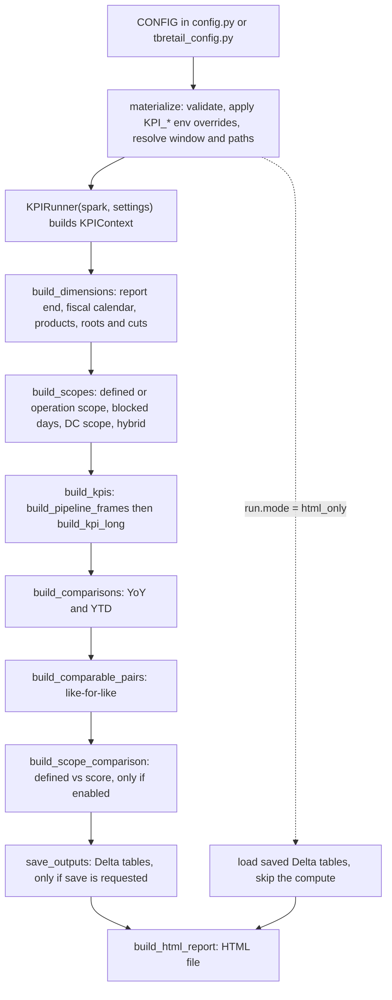

# Logic flow

This page explains how the pipeline turns source tables into the KPI numbers. It is written for analysts and engineers who need to explain a number. Every rule cites the code as `file:line`. The code is the source of truth. `README.md` has the full config reference.

Part 1 describes the generic pipeline (`config.py`). Part 2 gives the actual values of `tbretail_config.py`. The last section lists every filter and removal in one table.

Short vocabulary:

- **Pair**: a product and store combination.
- **Frame**: a Spark table that metrics are computed from (`scoped_daily`, `inst_data`, `lost_base`, `dc_daily`, `dc_inst`).
- **Root**: a population tab (`overall`, plus one per dimension-source value such as `nvrout`).
- **Cut**: a breakdown inside a root (for example `brand`).
- **GIT**: goods in transit.
- **Blocked day**: a day a pair is blocked in the UI blocked scope.

---

# Part 1 - General flow (`config.py`)

## 1. Config to settings and the reporting window

`CONFIG` is the only part you edit (`config.py:59`). `materialize()` (`config.py:617`) does five things:

1. Applies optional `KPI_*` environment overrides (`config.py:402-469`). `KPI_BUCKET` overrides the datastore bucket (`config.py:627`).
2. Builds every source path under the bucket `/mnt/invent-{customer}-datastore` from `path_segments` (`config.py:627-642`).
3. Validates the config and raises on bad combinations (`config.py:659-914`).
4. Resolves the reporting window (below).
5. Returns the flat `settings` dict that `KPIRunner` reads (`config.py:1044-1117`).

Switches that `materialize()` enforces:

| Config key | Rule | Line |
|---|---|---|
| `instock.method` | must be `daily`, `weekly_source` or `lost_sales_source` | `config.py:659` |
| `reporting_window.report_end` | must be `as_of`, `complete_month` or `latest_day` | `config.py:709` |
| `reporting_window.report_end = "latest_day"` | needs `instock.method = "daily"` | `config.py:879` |
| `defined_scope.grain` | `product`, `product_store` or `product_store_week`; store grains need `store_col` | `config.py:722-734` |
| `instock.method = "daily"` | needs a store grain, no `lost_sales_ensemble`, and a valid `count_start` | `config.py:858-869` |
| `scope_source.mode = "operation_scope"` | cannot use grain `product_store_week` | `config.py:793` |
| `blocked_scope.ui_parameters_path` | needs `scope_source.mode = "operation_scope"` | `config.py:808` |
| `blocked_scope.dc_solution_id` | needs `scope_source.dc_solution_id` | `config.py:835` |
| `scope_source.dc_solution_id` | needs `operation_scope` | `config.py:791` |
| `scope_source.instock_main_eligible_only` | needs `operation_scope`, `roll_to_family_main`, method `daily` | `config.py:870-876` |
| `scope_source.instock_exclude_unsuperseded_sizes` | needs method `daily` | `config.py:877` |
| `goods_in_transit.store_instock` | needs method `daily` | `config.py:911` |
| `goods_in_transit.inventory_metrics` | needs `use_fiscal_calendar = True`; needs `date_shift_days` set | `config.py:904-914` |
| `lost_sales_ensemble.enabled` | cannot combine with `weekly_source` or `daily` | `config.py:738`, `config.py:861` |
| `comparable_pairs.kinds` has `half` | needs `fiscal_calendar.half_periods = True` | `config.py:990-992` |

### Reporting window

Dates come from `_resolve_report_window` (`config.py:583-611`). All weeks run Sunday to Saturday.

| Setting | Rule | Config key |
|---|---|---|
| `REPORT_START_DATE` | the Sunday of the week that contains Jan 1 of the `as_of_date` year | `reporting_window.as_of_date` |
| `RUN_MIN_DATE` | the Sunday of the week containing `run_min_date`; must be on or before the report end | `reporting_window.run_min_date` |
| `EFFECTIVE_REPORT_START_DATE` | `RUN_MIN_DATE` if set, else `REPORT_START_DATE` | `reporting_window.run_min_date` |
| `REPORT_END_DATE` | `latest_day`: `as_of_date` itself. `as_of` and `complete_month`: the last completed Saturday on or before `as_of_date` | `reporting_window.report_end` |
| `RUN_WEEK_START_DATE` / `RUN_WEEK_END_DATE` | Sunday and Saturday of the `as_of_date` week | `reporting_window.as_of_date` |

Report-end modes:

- **`as_of`**: the window ends on the last complete Sunday-Saturday week. The Annual tab keeps partial years. YTD uses the fiscal months that are fully elapsed in the latest year, for every year (`fiscal.py:114-122`, `kpi_long.py:132-138`).
- **`complete_month`**: after the first step, `apply_report_end_mode` cuts `REPORT_END_DATE` back to the last day of the most recent fully elapsed month (`fiscal.py:228-272`). On the fiscal calendar the month bounds come from the unclipped upload, which must extend past the end date (`fiscal.py:242-247`). On the civil calendar the cut is the previous month end and is usually mid-week (`fiscal.py:221-226`). It raises if no month ends inside the window or the cut month starts before the window (`fiscal.py:260-270`).
- **`latest_day`**: the window ends on `as_of_date` itself. YTD covers fiscal days 1..K of every year, where K is the fiscal day number of the end date (`fiscal.py:275-332`). The other tabs show complete periods only. Lost sales stops at the last Saturday (see section 5).

`as_of_date` is also the default `output.run_date` (`config.py:998-1002`).

## 2. Run order

`KPIRunner.run()` (`runner.py:195-213`) runs these stages in order. In `html_only` mode it runs only `run_html_only` (`runner.py:183-193`). The notebook (`main.ipynb`) calls `run(save=False)` and saves in a later cell.

| # | Stage | Reads | Sets on `ctx` | Prints / displays |
|---|---|---|---|---|
| 0 | `materialize` | `CONFIG`, env | nothing (returns `settings`) | nothing |
| 1 | `print_config_summary` (notebook Cell 1, `runner.py:95-144`) | `settings` | nothing | customer, as-of date, window, fiscal flag, scope mode, instock method, GIT, slices, comparisons, save plan settings |
| 2 | `_reset_run_caches` (`runner.py:87-93`) | nothing | clears `daily_data_raw`, `daily_data_excluded_days`, `lost_sales_weekly_base`, `instock_weekly_base`, `item_family_raw`, `inventory_warehouse_rolled` | nothing |
| 3 | `build_dimensions` (`runner.py:223-225`) | fiscal_cal upload (or daily-data on the civil calendar), products table, dimension sources | `fiscal_cal`, `fiscal_week`, `products_attr`, `product_dims`, `active_slice_dimensions`, `cut_dimensions`, `root_definitions`, `complete_fiscal_periods`; `available_fiscal_months` (not `latest_day`); `ytd_through_day`, `ytd_years`, `day_calendar`, `ytd_lost_sales_last_week` (`latest_day` only). It can also change `settings["REPORT_END_DATE"]` (`complete_month`). | `report_end=complete_month: ...` cut line, `time grain`, `fiscal weeks`, fully elapsed months, latest complete period per tab, `ROOTS`, `CUT_DIMENSIONS`, `ACTIVE_SLICE_DIMENSIONS`, dimension-source join lines, `latest_day` YTD line (`fiscal.py:327-332`, `fiscal.py:562-575`, `fiscal.py:634-652`) |
| 4 | `build_scopes` (`runner.py:227-233`) | defined_scope or operation/scope, item_family, products, blocked-scope parquet, daily-data (score scope) | `scope_keys`, `defined_scope_keys`, `operation_scope_pairs`, `blocked_days`, `dc_scope_pairs`, `dc_blocked_days`, `score_only_scope_keys`, `hybrid_scope_keys` | scope pair counts, blocked pair-days, DC scope pairs, scope mode and final scope size (`scope.py:93`, `scope.py:175`, `scope.py:190`, `scope.py:209-212`, `scope.py:320`) |
| 5 | `build_kpis` (`runner.py:244-254`) | all frame sources (section 3) | `hybrid_frames`, `kpi_long` | `kpi_long shape`, slices, periods, then a table of the overall latest period of each period type |
| 6 | `build_comparisons` (`runner.py:256-261`) | `kpi_long` | `comparison_yoy`, `comparison_ytd`, `yoy_display`, `ytd_display`, `kpi_long_display` (trimmed copy for HTML) | one table per selected kind (overall root and cut) |
| 7 | `build_comparable_pairs` (`runner.py:263-268`) | `hybrid_frames` | `comparable_kpi_long`, `comparable_comparison_<kind>`, `comparable_<kind>_display` | one table per enabled kind (latest link, overall) |
| 8 | `build_scope_comparison` (`runner.py:270-282`) | rebuilds frames for the defined scope and the score scope | `defined_frames`, `score_frames`, `scope_diff` | `scope diff: skipped` when `scope.run_scope_diff` is off |
| 9 | save | the tables above | `save_plan` | save plan and `saved <table>` lines (`io.py:282`, `io.py:461-464`) |
| 10 | `build_html_report` (`runner.py:284-317`) | `kpi_long_display` and comparison tables | nothing | `HTML report written: ...` (`html_report.py:1813`); with `html_report.output_path_segments` set it also writes a copy to the datastore (`runner.py:305-315`) |

Notebook cells around the runner (`main.ipynb`):

- **Cell 2** previews scope, lost-sales and daily-data inputs with the same `input_filters`. It is read-only.
- **Scope debug cell** runs `prepare_scopes` (reset caches, `build_dimensions`, `build_scopes`), then displays distinct product, store and pair counts overall and per slice (`runner.py:319-322`, `scope_debug.py:14-71`). The next `run()` reuses that scope instead of building it again (`runner.py:198-200`, `runner.py:215-221`).
- **Cell 3** runs `runner.run(save=False)`.
- **Scope summary cell** displays row counts by `scope_origin` in the final scope (`runner.py:324-325`, `scope.py:448-458`).
- **Cell 4** previews the save plan (`runner.preview_save_plan`). **Cell 5** calls `save_outputs`.
- **Cell 6** builds the HTML report.
- Remaining cells display samples of `kpi_long`, comparisons, comparable pairs and the scope diff.

`html_only` mode applies the report-end mode, loads the saved tables, infers roots and cuts from the saved `kpi_long`, loads the fiscal weeks and trims the display copy (`runner.py:183-193`).

## 3. Data sources

Every Delta read goes through the functions in `inputs.py`. `input_filters.<source>` is a list of Spark SQL expressions applied to that source (`inputs.py:46-54`). A filter listed twice is applied twice.

| Source | Config key | Columns used | Filters and windows | Roll-up |
|---|---|---|---|---|
| Fiscal calendar upload | `path_segments.fiscal` | `date`, `Year`, `Week`, plus the `column_map` quarter, month and month-name columns | clipped to the window for `fiscal_cal`; unclipped when period bounds are needed (`fiscal.py:93-111`) | none |
| Daily data | `path_segments.daily_data` | `product_id`, `store_id`, date column, `sales_revenue`, `sales_quantity`, `inventory`; the week column on the civil calendar only (`inputs.py:249-251`) | `input_filters.daily_data`, then dates inside `[EFFECTIVE_REPORT_START_DATE, REPORT_END_DATE]` (`inputs.py:252-256`) | `item_family_rollup.daily_data` (default True) |
| Daily data, removed days | same table | `product_id`, `store_id`, date | the days `input_filters.daily_data` removes, window days only; empty without filters (`inputs.py:265-294`) | same roll-up |
| Daily data, in-stock copy | same table | `product_id`, `store_id`, date, `inventory`, `usable` (null counts as unusable) | no `input_filters`; dates from `instock.daily.history_start` (else window start) to the report end (`inputs.py:413-437`) | not rolled (already family-main) |
| Products | `path_segments.products` | `product_id`, `cogs`, `price_without_tax`, slice columns, `is_active`, `option_code` | `dropDuplicates(product_id)` (`fiscal.py:611-617`); active flag read separately (`inputs.py:358-364`) | none |
| Item family | `path_segments.item_family`, `item_family_source` | `product_id`, `parent_id`, `is_main` | `input_filters.item_family` (`inputs.py:311-325`) | the map itself |
| Operation scope | `path_segments.scope`, `scope_source` | `solution_id`, `run_date`, `end_date`, `product_id`, `location_id`, `start_date` | `solution_id` in the list, `run_date` equal to the scope run date, `end_date` null or on or after it; fails when no row (`inputs.py:335-355`) | `scope_source.roll_to_family_main` |
| Defined scope | `path_segments.defined_scope`, `defined_scope` | the configured product, store and week columns | `input_filters.defined_scope` (`inputs.py:57-67`) | `item_family_rollup.defined_scope` (default False) |
| Inventory warehouse (DC) | `path_segments.inventory_warehouse` | `product_id`, `warehouse_id`, `date`, `inventory` | `input_filters.inventory_warehouse`, then window dates (`pipeline.py:580-602`) | `item_family_rollup.inventory_warehouse` (default True), then re-summed per product, warehouse, date |
| Goods in transit | `path_segments.goods_in_transit`, `goods_in_transit` | `product_id`, `destination_id`, `destination_type`, `date`, `quantity` | `quantity > 0`; `destination_type` 0 = store, 1 = warehouse; dates shifted by `date_shift_days` (`pipeline.py:535-557`) | `goods_in_transit.roll_to_family_main` |
| Lost sales | `path_segments.lost_sales`, `lost_sales_source` | week, product or planning-level, optional store, `lost_sales`; `in_stock` and `total_days` only for method `lost_sales_source` | `input_filters.lost_sales`, then window weeks (`pipeline.py:82-109`) | `item_family_rollup.lost_sales` (default False) |
| Planning-level map | `path_segments.product_planning_level` | `planning_level_id`, `product_id` | inner join: lost-sales or in-stock rows without a mapping drop (`inputs.py:111-139`) | none |
| Weekly in-stock source | `instock.weekly_source` | week, product, optional store, in-stock days, total days | no config filter; `fallback_sources` fill only keys no earlier column set has (`inputs.py:160-192`) | `item_family_rollup.lost_sales` |
| Speed cluster | `lost_sales_ensemble` | `product_id`, cluster | ensemble only (`inputs.py:195-217`) | none |
| Blocked scope | `blocked_scope` | `product_id`, `destination_id`, `solution_id`, `start_date`, `end_date` | `solution_id` in the list; a row without `start_date` fails (`inputs.py:381-403`) | block product ids are not rolled |
| Dimension sources | `dimension_sources` | the configured columns | CSV or Delta (`fiscal.py:425-505`) | none |

Calendar:

- **Fiscal calendar** (`use_fiscal_calendar = True`): `Year`, `Week`, quarter and month come from the upload. The month and quarter number is the digits of the upload value (`M01` becomes 1). `Fiscal_Half` is 1 for quarters 1-2 and 2 for 3-4. A fiscal week takes its month and quarter from the upload rows of that week (`fiscal.py:23-84`).
- **Civil calendar** (`use_fiscal_calendar = False`): `Year` is the calendar year of the date and `Week` is the daily-data week column. A week that straddles Jan 1 becomes two partial weeks. Month is the calendar month of the week start and quarter is derived from it (`fiscal.py:1-6`, `fiscal.py:62-84`, `fiscal.py:374-395`).
- Either way the pipeline raises if a date is missing between the window start and end (`fiscal.py:344-360`), or if a fiscal week has a null quarter or month (`fiscal.py:539-555`).
- `goods_in_transit.inventory_metrics` needs the fiscal calendar (`config.py:913`).

Item-family roll-up (`pipeline.py:567-577`): a child product id becomes its parent id, using only the non-main rows of `item_family`. A product without a parent keeps its own id. The roll-up is one level.

## 4. Scope

Scope decides which pairs, and in which weeks, enter the frames. Steps run in the order below (`runner.py:227-233`).

### 4.1 Grain and weeks (`build_defined_scope`, `scope.py:291-320`)

| `defined_scope.grain` | Scope keys | Weeks |
|---|---|---|
| `product` | product, Year, Week | every window week |
| `product_store` | product, store, Year, Week | every window week |
| `product_store_week` | product, store, Year, Week | only the weeks in the table (not with operation scope) |

"Window weeks" are the fiscal weeks that overlap the window (`scope.py:26-31`). For the two week-agnostic grains, the pair list is cross-joined with every window week (`scope.py:317-318`). So a pair is in scope for the whole window, including weeks before its scope start date. The scope start date matters only for blocks and the daily in-stock count start (sections 4.4 and 5).

### 4.2 Source of the pair list (`scope_source.mode`)

**`defined_scope`**: reads the `defined_scope` table, applies `input_filters.defined_scope`, takes distinct product (and store) columns, and rolls to the family main only when `item_family_rollup.defined_scope` is True (`scope.py:34-47`).

**`operation_scope`** (`scope.py:59-96`):

1. Read `operation/scope` rows of `scope_source.solution_id` for the scope run date that are still open (`end_date` null or on or after the run date) (`inputs.py:344-347`). The run date is `scope_source.run_date`, or the latest Sunday on or before today when unset. It is not the report `as_of_date` (`scope.py:50-56`).
2. Roll each row to its family main if `roll_to_family_main` (`scope.py:70-73`).
3. Group by product and store. `scope_start` is the earliest `start_date`. `main_eligible` is true when at least one row belongs to the main itself, not only to a sub-item (`scope.py:74-77`).
4. If `active_only`, keep only products with `is_active = true` (`scope.py:78-79`).
5. Fail if any pair has no `start_date` (`scope.py:81-82`).
6. Keep the full pair table with `scope_start` and `main_eligible` on `ctx.operation_scope_pairs` for blocks and in-stock (`scope.py:90-96`).

The DC scope is built the same way for `scope_source.dc_solution_id`, with warehouse as the location (`scope.py:178-190`). It is skipped when `dc_solution_id` is None.

### 4.3 Hybrid scope (`scope.use_hybrid_scope`) and score scope (`build_hybrid_scope`, `scope.py:408-445`)

Score scope is computed only when `scope.use_hybrid_scope` or `scope.run_scope_diff` is on (`scope.py:418-425`).

Score rule (`scope.py:346-387`, `score_scope.min_percentile`, `score_scope.min_weeks_for_filter`):

- Per pair and week: weekly sales is the sum of sales units, weekly inventory is the last daily snapshot of the week.
- A pair-week is in score scope when both values reach that pair's percentile threshold, or when the pair has at most `min_weeks_for_filter` weeks.
- The score scope reads daily data with every store, after `input_filters.daily_data` (`scope.py:323-343`).

Hybrid = defined scope plus the score-scope keys for window weeks that the defined scope does not cover at all (`scope.py:433-441`). Only grain `product_store_week` can leave weeks uncovered, so with the other grains hybrid adds nothing (`scope.py:409-411`).

### 4.4 Blocked scope (`blocked_scope`, `scope.py:99-175`)

Needs `operation_scope`. Off when `blocked_scope.ui_parameters_path` is None (`scope.py:170-171`).

1. Read `{ui_parameters_path}/blocked_scope/{kind}` for each kind in `blocked_scope.kinds` (`product`, `product_destination`, `destination`), filtered to `blocked_scope.solution_id` (`inputs.py:381-403`).
2. Join each kind to `ctx.operation_scope_pairs`: `product` matches every store of the product, `product_destination` one pair, `destination` every product of the store (`inputs.py:367-378`, `scope.py:119-129`).
3. Apply `blocked_scope.rule` (`scope.py:130`):
   - `after_scope_start`: a block counts only when `block.start_date >= pair scope_start`. The same day counts. An earlier block is dropped.
   - `all`: every matched block counts.
4. A block covers `start_date` to `end_date` (null means the report end), clipped to the window (`scope.py:131-140`).
5. Overlapping and adjacent blocks of a pair are merged into disjoint intervals, so a day matches at most one interval (`scope.py:141-151`).

Block product ids are not rolled to the family main: only blocks on the main's own id apply (`scope.py:105-107`).

**DC blocked scope** (`scope.py:193-212`): needs `scope_source.dc_solution_id`, `blocked_scope.ui_parameters_path` and `blocked_scope.dc_solution_id`. It reads `{ui_parameters_path}/dc_blocked_scope/{kind}` for `blocked_scope.dc_kinds` (`product`, `product_destination`; `destination_id` is the warehouse). It matches against the DC scope pairs with the same `rule`.

Blocked days are not removed from the scope. They are flagged `is_blocked` on `scoped_daily` and `dc_daily`, and each metric decides whether to read them (section 6). The in-stock frames and the lost-sales sales denominator drop them when they are built (`pipeline.py:403`, `pipeline.py:831-832`).

### 4.5 What each step removes

| Step | Removes |
|---|---|
| operation scope run date and `end_date` | scope rows already ended on the run date |
| `roll_to_family_main` | nothing; children become their main |
| `active_only` | pairs of inactive products |
| score scope (hybrid) | adds weeks, never removes |
| blocked scope | nothing from scope; flags days |

## 5. Frames

`build_pipeline_frames` builds all frames for one scope table (`pipeline.py:740-885`). Each metric family is restricted to scope on its own. They only meet in the per-period join (`metrics.py:321-356`).

**`scope_core`**: distinct scope keys (`pipeline.py:762`). `scope_pairs` is its distinct (product, store) pairs. `scope_pair_weeks` is `scope_core` itself with a store grain.

### Lost sales (`read_lost_sales_weekly`, `pipeline.py:132-219`)

- **Single model** (`lost_sales_ensemble.enabled = False`): read `PATH_LOST_SALES`, map planning level to product if `product_agg_level_col` is set, apply `input_filters.lost_sales`, keep window weeks, sum `lost_sales` per product (and store if the source has one) per week.
- **Ensemble** (`lost_sales_ensemble.enabled = True`): read the fast model (`path_segments.lost_sales`) and the slow model (`slow_path_segments`), full-outer join them, and join the product speed cluster. Products whose cluster is in `fast_mover_clusters` take the fast model for all of `lost_sales`, `in_stock_days`, `total_days`. All other products, including those without a cluster, take the slow model. A pair-week exists only if the chosen model has a `total_days` value (`pipeline.py:181-203`). It cannot combine with `instock.method` `daily` or `weekly_source`.
- Then the weeks are joined to the fiscal week table. A row whose week start is not a fiscal week start of the window drops (`pipeline.py:28-44`, `pipeline.py:215-218`).
- Finally the weekly table is restricted to scope at its own grain: a source without `store_id` is semi-joined on product, Year, Week only, so it is never repeated per store (`pipeline.py:764-770`).

### In-stock frame `inst_data`

Every method produces rows with `stocked_pairs` (in-stock days) and `available_days` (counted days). `in_stock_rate` is their ratio (`metrics.py:275-278`).

| `instock.method` | Source of the two counts | Rule |
|---|---|---|
| `lost_sales_source` | `in_stock_days` and `total_days` of the weekly lost-sales table | `available_days = coalesce(total_days, fiscal_week_days)`; rows with `available_days <= 0` drop (`pipeline.py:804-822`) |
| `weekly_source` | the separate weekly table, restricted to scope at its own grain | `available_days = total_days` as is; rows with `available_days <= 0` drop (`pipeline.py:778-783`, `pipeline.py:804-822`) |
| `daily` | built from daily data (below) | see below |

**Daily method** (`build_instock_daily`, `pipeline.py:375-518`):

1. **Pairs**: the scope pairs, then `instock.daily.input_filters` (Spark SQL on `product_id` / `store_id`), then, when `scope_source.instock_main_eligible_only`, minus the pairs where `main_eligible` is false (`pipeline.py:407-411`), then, when `scope_source.instock_exclude_unsuperseded_sizes`, minus the unsuperseded sizes (`pipeline.py:412-414`). An unsuperseded size is a product that is in no `item_family` row, whose class color (`products.option_code`) has another size that is in `item_family` (`pipeline.py:521-532`).
2. **Daily rows**: the in-stock copy of daily data (no `input_filters.daily_data`, no family roll-up), kept for those pairs. When `in_stock_rate` is in `blocked_scope.metrics`, blocked days are dropped here (`pipeline.py:415-418`). It raises if the latest daily date is before the report end, because later days would count as out of stock (`pipeline.py:419-425`).
3. **Count start** per pair (`instock.daily.count_start`): `first_daily_row` is the first remaining daily row from `history_start`; `scope_start` is the operation scope start (first daily row when missing); `earliest` is the earlier of the two (`pipeline.py:427-447`). `require_daily_data` drops pairs with no daily row. The count start is clipped to the window start, and pairs that start after the window end drop (`pipeline.py:443-450`).
4. **Counted store-days** per pair-week: days in the week from the count start to the window end. Then subtract blocked days (when `in_stock_rate` is gated) and unusable days (when `usable_only`) (`pipeline.py:480-505`). A day with no daily row stays counted and is out of stock.
5. **In-stock days**: a counted day with `inventory > 0` (and usable, when `usable_only`). With `goods_in_transit.store_instock`, a day with store GIT also counts, united with on-hand days, never summed. GIT days outside the count start, blocked days (when gated) and unusable days are removed first (`pipeline.py:462-478`). Unusable means `usable != 1` or null (`inputs.py:435`).
6. `available_days = counted_days - removed_days`; rows with `available_days <= 0` drop; the result is restricted to `scope_core` keys, so a pair only counts in weeks where it is in scope (`pipeline.py:507-517`).
7. With `report_end = "latest_day"`, the week that contains day K is split into two rows (days up to K and after) so YTD keeps exactly days 1..K (`pipeline.py:55-70`).

### `scoped_daily` (`build_scoped_daily`, `pipeline.py:314-372`)

Order of steps:

1. Cached daily data (`input_filters.daily_data`, window dates, family roll-up).
2. Keep scoped pairs (semi-join on product and store) (`pipeline.py:340-341`).
3. If any metric in `goods_in_transit.inventory_metrics` reads store stock (`context.STORE_GIT_METRICS`): full-outer join store GIT. Daily rows are first summed to one row per pair-day. A GIT-only day gets sales, revenue and inventory 0 and `has_daily_row = False`. GIT-only days whose daily row `input_filters.daily_data` removed (for example `usable = 1`) are dropped, so a removed day does not come back as a zero-sales stock day (`pipeline.py:275-311`). Otherwise every row has `has_daily_row = True` and `git_quantity = 0`.
4. Flag `is_blocked` from the store block intervals (`pipeline.py:255-266`).
5. Attach the calendar (inner join: dates not in the fiscal calendar drop). On the civil calendar, `Year` and `Week` come from the date and the week column.
6. Keep rows whose (pair, Year, Week) is in `scope_core` (`pipeline.py:359-360`).
7. Inner join the product table (products missing from it drop) and add `inventory_retail = round(inventory * price_without_tax, 2)`, `inventory_cost = round(inventory * cogs, 2)`, `sales_cost = round(sales_quantity * cogs, 2)` (`pipeline.py:361-366`).
8. Attach fiscal week attributes and `week_days` (7, or fewer for a part week under `latest_day`) (`pipeline.py:73-79`).

Rows kept: all real daily rows in scope. Rows flagged: `is_blocked`, `has_daily_row`, `git_quantity`.

### `lost_base` (`pipeline.py:827-874`)

- Lost-sales rows restricted to scope (above), with each week's `sales_quantity_weekly` joined on.
- Sales come from `scoped_daily` real rows (`has_daily_row`). Blocked days are removed when `lost_sales_pct` is in `blocked_scope.metrics`. `lost_sales_source.sales_filter` (Spark SQL) narrows the sales half (`pipeline.py:829-838`).
- Sales are summed to the grain of the lost-sales source (product-week when it has no store). A week with no sales is 0 (`pipeline.py:842-868`).
- `TY_sales_quantity_weekly_corrected_lost_sales = floor(sales_quantity_weekly + lost_sales)` per row (`pipeline.py:869-872`).
- Under `latest_day`, only weeks that end on or before the last Saturday on or before the report end are kept (`pipeline.py:858-864`).

### `dc_daily` (`build_dc_daily`, `pipeline.py:610-652`)

1. Rolled DC inventory per product, warehouse, date.
2. If any DC metric is in `goods_in_transit.inventory_metrics` (`context.DC_GIT_METRICS`): full-outer join warehouse GIT. A GIT-only day has inventory 0 and `has_inventory_row = False`.
3. Flag `is_blocked` from the DC block intervals.
4. Attach the calendar, keep product-weeks that are in `scope_core`, then keep only (product, warehouse) pairs in the DC scope when `scope_source.dc_solution_id` is set.
5. Left join product dimensions (a product missing from the products table stays, with null dimensions).

### `dc_inst` (`build_dc_inst`, `pipeline.py:655-737`)

- With `dc_instock.enabled = False`: an empty frame, so `dc_in_stock_rate` stays null (`pipeline.py:669-685`).
- Otherwise: each (product, warehouse) pair gets a daily grid from its first inventory row to the window end. Missing days count as 0 inventory. The grid is limited to scope product-weeks and to DC scope pairs (`pipeline.py:691-711`).
- A day is stocked when `inventory > dc_instock.stock_threshold`, or with `goods_in_transit.dc_instock` when GIT goes to that warehouse (`pipeline.py:715-721`).
- DC blocked days leave both counts only when `dc_in_stock_rate` is in `blocked_scope.metrics`. `dc_unblocked_days` counts unblocked days either way (`pipeline.py:722-731`).
- A pair that was never stocked inside the window has no row (`pipeline.py:658-659`).

### Goods in transit (`pipeline.py:535-564`)

GIT is read for the window shifted by `goods_in_transit.date_shift_days`. A snapshot dated D - shift is taken to describe the end of day D (shift -1: the snapshot dated D+1 is the end of day D). It keeps `quantity > 0` of the destination type, rolls to the family main if `roll_to_family_main`, and sums per day. It reaches only `scoped_daily` and `dc_daily` (inventory metrics) and the two in-stock frames (`store_instock`, `dc_instock`). It never reaches lost sales (`pipeline.py:744-749`).

## 6. Metrics

All 23 metrics of `METRICS_ALL` (`config.py:42-48`). All are computed by `compute_kpis` and `build_kpi_table` (`metrics.py:116-356`). `metrics.metric_cols` decides which are written to `kpi_long` (`kpi_long.py:262-263`).

How to read the table:

- **Blocked-day gate**: if the metric is in `blocked_scope.metrics`, blocked rows are not read (`metrics.py:30-38`). If not, blocked rows are read. Under `blocked_scope.metrics = "all"` every metric is gated.
- **GIT**: whether naming the metric in `goods_in_transit.inventory_metrics` changes it. Metrics not in `INVENTORY_GIT_METRICS_ALL` never use GIT (`config.py:51-54`).
- Dates: "daily rows" means the rows of that frame in the period.
- Daily-stock averages: per day, add up the stock of every pair in the root and cut, then average that over days. A day counts when a real daily row exists. When the metric uses GIT, a day also counts when only GIT rows exist (`metrics.py:59-74`).
- `_per_unit` returns null when units are 0 (`metrics.py:41-46`).

| Metric | Formula | Frame | Rows read | Blocked-day gate | GIT effect | Notes |
|---|---|---|---|---|---|---|
| `total_sales_quantity` | sum of `sales_quantity` | `scoped_daily` | real daily rows (`has_daily_row`) | gated if listed | none | `metrics.py:158` |
| `total_sales_revenue` | sum of `sales_revenue` | `scoped_daily` | real daily rows | gated if listed | none | `metrics.py:159` |
| `AUR` | sum `sales_revenue` / sum `sales_quantity` | `scoped_daily` | real daily rows | gated if listed | none | null when units are 0 (`metrics.py:160`) |
| `AUC` | sum `sales_cost` / sum `sales_quantity` | `scoped_daily` | real daily rows | gated if listed | none | `sales_cost` is `sales_quantity * cogs` per row (`metrics.py:161`) |
| `total_inventory` | sum over days and pairs of `inventory` | `scoped_daily` | real daily rows; with GIT, every row including GIT-only days | gated if listed | adds `git_quantity` to each row | a sum of daily on-hand, not a snapshot (`metrics.py:157`, `metrics.py:171-182`) |
| `distinct_product_count` | distinct `product_id` | `scoped_daily` | real daily rows | gated if listed | none | counts products with a daily row, not only selling ones (`metrics.py:162-164`) |
| `distinct_store_count` | distinct `store_id` | `scoped_daily` | real daily rows | gated if listed | none | `metrics.py:165` |
| `distinct_pair_count` | distinct (`product_id`, `store_id`) | `scoped_daily` | real daily rows | gated if listed | none | `metrics.py:166-169` |
| `mean_stock` | average over days of the day's total store inventory (units) | `scoped_daily` | per day; real daily rows, or any row with GIT | gated if listed | adds GIT units | `metrics.py:236-238` |
| `mean_stock_retail` | same, valued at `price_without_tax` | `scoped_daily` | same | gated if listed | adds `round((inventory + GIT) * price, 2)` | `metrics.py:51-56` |
| `mean_stock_cost` | same, valued at `cogs` | `scoped_daily` | same | gated if listed | adds `round((inventory + GIT) * cogs, 2)` | `metrics.py:51-56` |
| `dc_mean_stock` | average over days of the day's total DC inventory | `dc_daily` | per day; real inventory rows, or any row with GIT | gated if listed (DC blocks) | adds DC GIT | `metrics.py:243-248` |
| `total_mean_stock` | average over the store days of (store stock + DC stock that day) | `scoped_daily` + `dc_daily` | store days; DC stock is left-joined, a missing DC day is 0 | gated if listed (store and DC blocks) | adds store GIT and DC GIT | a day with no store row does not count even if the DC has stock (`metrics.py:249-258`) |
| `WOS` | sales-weighted mean of weekly store WOS | `scoped_daily` | see below | gated if listed (stock and sales) | adds store GIT to the stock part | weeks of supply in units |
| `wos_revenue` | same, stock at retail value, sales as revenue | `scoped_daily` | see below | gated if listed | adds store GIT valued at retail | |
| `wos_cost` | same, stock at cost, sales as `sales_cost` | `scoped_daily` | see below | gated if listed | adds store GIT valued at cost | |
| `WOS_DC` | sales-weighted mean of weekly (DC stock) / sales units | `dc_daily` + `scoped_daily` sales | see below | gated if listed (sales on store blocks, DC stock on DC blocks) | adds DC GIT | store stock is not used (`metrics.py:24`) |
| `WOS_TOTAL` | sales-weighted mean of weekly (store + DC stock) / sales units | both | see below | gated if listed | adds store and DC GIT | |
| `inventory_turnover_rate` | sales units / mean daily store stock | `scoped_daily` | sales on real rows; stock per day | gated if listed | adds store GIT to the stock | null when mean stock is 0; not annualised (`metrics.py:260-273`) |
| `in_stock_rate` | max(0, sum `stocked_pairs` / sum `available_days`) | `inst_data` | all rows of the frame | the frame drops blocked days at build time when listed (daily method) | `store_instock` (daily method only) | `metrics.py:275-278` |
| `weighted_instock_rate` | per week: in-stock rate of the root and cut; then the average of those weekly rates weighted by each week's sales units | `inst_data` + `scoped_daily` | in-stock rows; sales on real rows | sales weights drop blocked days if listed | in-stock side follows `store_instock` | grouped by week and cut, not by product (`metrics.py:289-307`) |
| `dc_in_stock_rate` | max(0, sum `dc_stocked_days` / sum `dc_available_days`) | `dc_inst` | all rows | `dc_inst` drops DC blocked days at build time when listed | `goods_in_transit.dc_instock` | null when `dc_instock.enabled` is False (`metrics.py:280-284`) |
| `lost_sales_pct` | 100 * sum `lost_sales` / sum `floor(sales + lost_sales)` | `lost_base` | all rows | the sales half drops blocked days at build time when listed | none | null when the denominator is 0 (`metrics.py:341-356`) |

**WOS family detail** (`metrics.py:183-233`):

1. Per product, fiscal week and period, the daily stock of the product (summed over stores) is averaged over the week's days. Weekly sales are summed over the week's days.
2. Weekly WOS = average daily stock x `week_share` / weekly sales. `week_share = week_days / 7`, which is 1 except for a week that `latest_day` cuts mid-week. Weeks with sales of 0 or less give no value.
3. Period WOS = sum(weekly WOS x weekly sales) / sum(weekly sales).
4. `WOS_DC` and `WOS_TOTAL` add the product's average daily DC stock for the same week. A week with no DC record counts 0 DC stock.
5. When a WOS metric is gated, blocked days leave both its stock and its sales.

**Population filters** (`metrics.population_filters`, `filters.py:62-108`): a per-metric filter on a dimension. Metrics that are computed together share one filter group (`filters.py:64-78`). Two metrics in one group with different specs for the same dimension raise.

## 7. Periods, roots, cuts, comparisons

### Period types (`kpi_long.py:19-26`, `_period_frames` `kpi_long.py:116-139`)

| Period | Key | Frame rule (not `latest_day`) | Frame rule (`latest_day`) |
|---|---|---|---|
| `annual` | `Year` | all window rows; partial first and last years are included | complete fiscal years only (`kpi_long.py:118-119`) |
| `quarter` | `Year-Fiscal_Quarter` | complete quarters only | same |
| `half` (only with `fiscal_calendar.half_periods`) | `Year-Fiscal_Half` | complete halves only | same |
| `monthly` | `Year-Fiscal_Month` | complete months only | same |
| `weekly` | `Year_Week` | all weeks; civil calendar with `complete_month` drops the partial trailing week (`kpi_long.py:68-78`) | complete weeks only (`kpi_long.py:120-121`) |
| `ytd` | `Year` | rows whose `Fiscal_Month` is a fully elapsed month of the latest year, for every year (`kpi_long.py:132-138`) | days 1..K of every year in `ytd_years` (below) |

Complete period: its real start is on or after `EFFECTIVE_REPORT_START_DATE` and its real end is on or before `REPORT_END_DATE` (`fiscal.py:207-218`). Bounds come from the unclipped fiscal upload, which must extend past the window for edge periods to be caught (`fiscal.py:145-171`). On the civil calendar they are computed (`fiscal.py:174-204`).

### `latest_day` YTD cut (`kpi_long.py:81-104`, `fiscal.py:275-332`)

- K is the fiscal day number of the report end (from each year's first date in the unclipped upload, or Jan 1 on the civil calendar).
- `ytd_years` are the years whose day 1 is on or after the window start and whose day K is on or before the window end (`fiscal.py:312-316`).
- `scoped_daily` and `dc_daily` keep `day_index <= K`. `inst_data` and `dc_inst` keep `last_day_index <= K`. `lost_base` keeps `Week <= ytd_lost_sales_last_week`, the fiscal week of the last Saturday on or before the end (0 if that Saturday is in the previous fiscal year). `WOS` weights the cut week by its elapsed days / 7 (`fiscal.py:335-341`).

### Roots and cuts (`fiscal.py:508-531`, `kpi_long.py:231-265`)

- **Roots**: `overall`, plus one root per entry of `root_values` of each enabled dimension-source column. Without `root_values`, there is one root per distinct non-null value. A root restricts all five metric frames to rows where the column equals the value (nulls drop) (`kpi_long.py:247-250`).
- **Cuts**: `overall`, plus each `cut_dimensions` entry. Cut dimensions are the slice dimensions (`slices.dimensions`, `slices.derived_dimensions`, dimension-source columns) minus the root columns (`fiscal.py:631-632`).
- Derived dimensions are SQL on the products table. One that fails to resolve is skipped with a NOTE (`fiscal.py:601-609`). A slice dimension that is not in the products table or any enabled source is skipped with a NOTE (`fiscal.py:590-599`).
- **Dimension sources** are left-joined to products by `join_key`. Products absent from the source get null, and `fillna` replaces those nulls (`fiscal.py:480-494`).
- **Value filters** (`slices.value_filters`, `filters.py:11-59`): a list means include only those values and drop nulls. A dict can set `include`, `exclude`, `keep_null`; nulls are kept unless `include` is given, unless `keep_null` says otherwise. Applied to a cut's own dimension only, on all five frames (`kpi_long.py:201-212`, `kpi_long.py:252`).

### Comparisons (`comparisons.py`)

- `comparisons.enabled` picks `yoy` and `ytd` (`config.py:955`).
- **YoY**: the latest two annual rows, per root and cut value (`comparisons.py:174-199`).
- **YTD**: every consecutive pair of `ytd` years (`comparisons.py:202-229`).
- **Change**: percent change = (current - prior) / abs(prior), or none when prior is 0. Metrics in `metrics.pp_change_metrics` show a difference in percentage points instead. For `in_stock_rate`, `weighted_instock_rate`, `dc_in_stock_rate` the difference is x100 because they are fractions. `lost_sales_pct` is already in percent (`comparisons.py:55-63`).
- Comparisons read `kpi_long` annual and ytd rows, so they follow `report_end`.
- A one-year window gives no comparison.

### Comparable pairs (`comparable_pairs`, `comparable.py`)

Like-for-like comparison. Off unless `comparable_pairs.enabled`. For each kind in `comparable_pairs.kinds`:

1. Take the kind's period frames (same completeness as above).
2. To find the pairs present in a year, look at real daily rows only (`has_daily_row`). With `pair_days = "unblocked"` blocked days do not count as presence either (`comparable.py:233-240`). `all` lets blocked days count.
3. A pair qualifies if it appears in every qualifying year (intersection) (`comparable.py:249-251`). The pair grain is `comparable_pairs.grain`: `product_store` or `product`.
4. Recompute every metric over that one pair population and compare each consecutive year link: every year of the kind is computed once, then split into links (`comparable.py:259-300`).
5. `dc_daily` and `dc_inst` each get their own (product, warehouse) universe (`comparable.py:250-251`, `comparable.py:98-102`). `dc_inst` rows need `dc_unblocked_days > 0` under `unblocked`.
6. Kinds: `ytd` (YTD window, `ytd_years` under `latest_day`), `yoy` (full years), `quarter` and `half` (per quarter or half number, only years where it is complete, `comparable.py:106-112`).
7. A kind needs at least 2 qualifying years, otherwise it is skipped (`comparable.py:246-247`).
8. Results carry `comparable_pair_count`, `link_prior_year`, `link_current_year` (`comparable.py:282-288`).

### Scope diff (`scope.run_scope_diff`, `comparisons.py:329-361`)

Annual `metrics.scope_diff_metrics` under the defined scope versus the score-only scope, with `abs_diff` and `pct_diff`.

## 8. Outputs

### Save (`output`, `io.py`)

Tables (`io.py:102-115`): `kpi_long`, `comparison_yoy` / `comparison_ytd` (per `comparisons.enabled`), `scope_diff`, and with `comparable_pairs` on: `comparable_kpi_long` and one `comparable_comparison_<kind>` per kind. Each goes to `{output_root}/{table}/run_date={run_date}/` (`io.py:118-120`). `output_root` is `output.path_segments`; `run_date` is `output.run_date`, else `as_of_date`. Empty or missing tables are skipped (`io.py:413-415`). Writes are Delta overwrite and add `_run_as_of` and `_saved_at` (`io.py:268-279`, `io.py:458-459`).

| `output.save_mode` | Behaviour | Line |
|---|---|---|
| `initial` | raises if the table already exists | `io.py:429-434` |
| `incremental` | loads the latest partition on or before `run_date`, appends keys not yet saved, replaces overlapping keys only when `allow_overwrite_existing` is True. Under `latest_day`, `ytd` rows of `kpi_long` and `comparable_kpi_long` are always replaced | `io.py:207-265`, `io.py:443-456` |
| `full_refresh` | writes only this run's rows and overwrites the partition | `io.py:420-428` |

Merge keys per table are in `TABLE_ROW_KEYS` (`io.py:64-90`). With `incremental` and `recompute_comparisons_from_history`, and a prior `kpi_long` partition, the comparison tables are recomputed from the merged `kpi_long` and overwritten whole. The comparable comparison tables are recomputed the same way (`io.py:522-562`, `io.py:626-650`). `save=False` skips the save; `SAVE_OUTPUTS = False` also skips it (`io.py:566-576`).

### HTML report (`html_report`, `html_report.py`)

- Built from `kpi_long_display`: `kpi_long` trimmed to the most recent periods per tab, using `weekly_display_weeks`, `monthly_display_months`, `quarterly_display_quarters`, `half_display_halves`, `yearly_display_years` (`kpi_long.py:158-198`). Weekly counts fiscal weeks, and under `latest_day` the trailing partial week takes no slot.
- Layout: one outer tab per root when there is more than one (`html_report.root_labels` renames them), period tabs (Annual, YTD, Quarter, Half, Monthly, Weekly), cut tabs (`html_report.dimension_labels` renames them), a metric table, YoY and YTD comparison tables on the Annual and YTD tabs, comparable tables, and a Metric Details tab (`html_report.py:1565-1574`, `html_report.py:1646-1681`, `html_report.py:1692-1775`).
- The header shows client, window, scope mode (Hybrid, Operation scope, Defined only) and, under `latest_day`, a "Period basis" card (`html_report.py:1499-1562`).
- Metric Details text comes from `DEFAULT_METRIC_DEFINITIONS` plus settings notes: blocked days, GIT, daily in-stock, `latest_day` lost-sales and WOS notes. `html_report.metric_definitions` overrides it (`html_report.py:59-362`).
- The file name is `html_report.filename` with `{customer}` and `{report_end}`. It is written to the local folder, and also to the datastore folder when `html_report.output_path_segments` is set (`runner.py:294-315`).

---

# Part 2 - tbretail flow (`tbretail_config.py`)

Values below are the actual config values. Where a value differs from the generic default, it is marked. `main.ipynb` loads `./config`; `tbretail_config.py` states `%run ./tbretail_config` as the intended load (`tbretail_config.py:5`).

## 1. Config to window

| Setting | tbretail value | Line |
|---|---|---|
| `customer` | `tbretail` | `tbretail_config.py:67` |
| `reporting_window.as_of_date` | `2026-10-02` | `tbretail_config.py:72` |
| `reporting_window.run_min_date` | `2024-02-06`, resolves to Sunday `2024-02-04` | `tbretail_config.py:73` |
| `reporting_window.report_end` | `latest_day` (default is `as_of`) | `tbretail_config.py:74` |
| `fiscal_calendar.use_fiscal_calendar` | True, columns `Quarter`, `Month`, `month_name` | `tbretail_config.py:77-83` |
| `fiscal_calendar.half_periods` | True (default is False) | `tbretail_config.py:78` |
| `output.save_mode` | `full_refresh`; `output.run_date` `2026-10-02` | `tbretail_config.py:428-429` |

Effect: the window runs from 2024-02-04 to `as_of_date` itself. YTD is fiscal days 1..K of every year that lies in the window. Annual and weekly tabs show complete periods only. Lost sales and lost-sales YTD stop at the last Saturday. The Half tab and the `half` comparable kind are on.

## 2. Run order

Same stages as Part 1. Notes for tbretail:

- `latest_day` means `ytd_through_day`, `ytd_years`, `day_calendar`, `ytd_lost_sales_last_week` are set in `build_dimensions` and there is no `available_fiscal_months`.
- `scope.run_scope_diff` is off, so `scope diff: skipped` is printed.
- `comparable_pairs.enabled` is True, so one comparable table is shown per kind.

## 3. Data sources

| Source | tbretail path (under `/mnt/invent-tbretail-datastore`) | Filter | Roll-up |
|---|---|---|---|
| fiscal calendar | `one_time_uploads/fiscal_cal` | clipped to the window | none |
| daily data | `noob/daily-data` | `input_filters.daily_data = ["usable = 1"]` (same as the default) | `daily_data` True |
| inventory warehouse | `operation/inventory_warehouse` | none | `inventory_warehouse` True |
| item family | `operation/item_family` | none | the map |
| operation scope | `operation/scope` | solution 21 (store), 22 (DC) | `roll_to_family_main` True |
| goods in transit | `operation/goods_in_transit` | shift -1 | `roll_to_family_main` True |
| products | `master-data/products` | none | none |
| lost sales | `reporting/future_visibility/reporting_inv_fc_dfu/report_dfu` | `input_filters.lost_sales` is empty | `lost_sales` False |
| product planning level | `operation/product_planning_level` | inner join map | none |
| defined scope | `analysis/instock_rate/instock_rate_scope` | not read (`operation_scope` mode) | `defined_scope` False |

Lines: `tbretail_config.py:92-123`.

- The lost-sales table has no store column and is keyed by `product_agg_level`, mapped to `product_id` through the planning-level table (`tbretail_config.py:305-314`). Lost sales is therefore restricted to scope at product and week, not per store.
- The weekly in-stock source (`instock.weekly_source`) is configured but unused, because `instock.method = "daily"` (`tbretail_config.py:260`).
- The lost-sales ensemble is off (`tbretail_config.py:315-323`).
- ECOM stores 829, 639 and 917 are not removed from `daily_data`, so they stay in every sales, inventory, WOS and distinct metric. They are removed only from the daily in-stock pairs (`instock.daily.input_filters`, `tbretail_config.py:266`) and from the sales half of the lost-sales denominator (`lost_sales_source.sales_filter`, `tbretail_config.py:313`).

## 4. Scope

| Step | tbretail value | Line |
|---|---|---|
| mode | `operation_scope`, solution 21 | `tbretail_config.py:128-129` |
| DC solution | 22 | `tbretail_config.py:130` |
| run date | None: latest Sunday on or before today, not `as_of_date` | `tbretail_config.py:131` |
| `roll_to_family_main`, `active_only` | True, True | `tbretail_config.py:132-133` |
| `instock_main_eligible_only` | True | `tbretail_config.py:136` |
| `instock_exclude_unsuperseded_sizes` | True | `tbretail_config.py:139` |
| grain | `product_store` | `tbretail_config.py:142` |
| hybrid and score scope | off | `tbretail_config.py:151-157` |
| blocked scope | on, rule `after_scope_start`, store solution 21, DC solution 22, kinds `product`, `product_destination`, `destination`, DC kinds `product`, `product_destination` | `tbretail_config.py:237-250` |

Result of the scope step: pairs of solution 21 on the scope run date, rolled to the family main, active products only, for every window week. NVROUT, COMP and NON-COMP are labels from `dimension_sources`, not scope. DC pairs of solution 22 are kept for the DC metrics, limited to products in the store scope.

Blocked days (store and DC) are flagged, not removed. The metrics that skip them are in `blocked_scope.metrics`:

- **Skip blocked days**: `in_stock_rate`, `weighted_instock_rate`, `dc_in_stock_rate`, `total_inventory`, `mean_stock`, `mean_stock_retail`, `mean_stock_cost`, `dc_mean_stock`, `total_mean_stock`, `WOS`, `wos_revenue`, `wos_cost`, `WOS_DC`, `WOS_TOTAL`, `inventory_turnover_rate` (`tbretail_config.py:245-249`).
- **Keep blocked days**: `total_sales_quantity`, `total_sales_revenue`, `AUR`, `AUC`, `distinct_product_count`, `distinct_store_count`, `distinct_pair_count`, `lost_sales_pct`. The config comment says a blocked pair can still sell its existing stock (`tbretail_config.py:235-236`).

## 5. Frames

- `scope_core`: scope pairs x every window week.
- `scoped_daily`: daily rows with `usable = 1` for scope pairs. Store GIT is joined (inventory metrics name every GIT metric, `tbretail_config.py:295-298`), so GIT-only days exist with `has_daily_row = False`. A GIT-only day whose daily row has `usable != 1` (or null usable) is dropped. Blocked days are flagged.
- `inst_data` (`instock.method = "daily"`): pairs are scope pairs, minus stores 829, 639, 917, minus sub-only stores (main item not eligible), minus unsuperseded sizes. Count start is `earliest` (earlier of scope start and first daily row), searched from `history_start` 2024-02-04. `require_daily_data` and `usable_only` are True. Blocked days leave the store-days (`in_stock_rate` is gated). Store GIT days count as in stock (`store_instock` True) (`tbretail_config.py:259-267`, `tbretail_config.py:293`).
- `lost_base`: `report_dfu` lost sales at product and week, with sales from `scoped_daily` real rows, ECOM stores removed from the sales, blocked days kept. Only weeks ending on or before the last Saturday.
- `dc_daily`: rolled warehouse inventory plus warehouse GIT (shift -1), blocked DC days flagged, restricted to DC solution 22 pairs among store-scope products.
- `dc_inst`: empty. `dc_instock.enabled` is False, so `dc_in_stock_rate` is null and is not in `metric_cols` (`tbretail_config.py:286-289`). `goods_in_transit.dc_instock = True` has no effect.

## 6. Roots, cuts, periods, comparisons

- **Cuts**: `brand` (shown as "Banner") and the derived dimension `SMW` (`KNG` if brand is `KNG`, else `SMW`) (`tbretail_config.py:327-331`, `tbretail_config.py:445`).
- **Roots**: `overall`, `nvrout` and `comp` (shown as "LFL"). `IS_NVROUT` comes from `operation/extended_product` (`program LIKE '%NVROUT%'`, absent products get `no`; only `yes` becomes a root). `IS_COMP` is `no` for products in the NON-COMP CSV and `yes` for all other products; only `yes` becomes a root (`tbretail_config.py:334-362`, `tbretail_config.py:444`).
- **Periods**: annual (complete fiscal years), quarter, half, monthly, weekly (complete periods only), ytd (days 1..K).
- **Comparisons**: `comparisons.enabled = ["yoy"]`, so only YoY is built (`tbretail_config.py:414`). `pp_change_metrics` are `in_stock_rate` and `lost_sales_pct`.
- **Comparable pairs**: on, kinds `ytd`, `yoy`, `quarter`, `half`, grain `product_store`, `pair_days = "unblocked"` (`tbretail_config.py:416-421`).
- **Population filter**: `in_stock_rate` excludes `IS_COMP = "no"`, in every root including `overall` (`tbretail_config.py:406-408`).
- **HTML**: title "TBretail KPI Report", weekly 5, monthly 5, quarterly 5, half 4, annual all (`tbretail_config.py:433-446`).

## 7. Per-metric table for tbretail

The 20 reported metrics (`tbretail_config.py:367-373`). Not reported: `wos_revenue`, `weighted_instock_rate`, `dc_in_stock_rate`. They are still calculated inside `compute_kpis`, but they are not written to `kpi_long`.

Rules that apply to every row:

- Scope is the operation scope of solution 21.
- Only daily rows with `usable = 1` exist in `scoped_daily`.
- Daily data and DC inventory are rolled to the family main.
- ECOM stores 829, 639, 917 are included, except where stated.
- NON-COMP products (`IS_COMP = no`) are included, except in `in_stock_rate`.

| Metric | Blocked days | Goods in transit | ECOM stores | Other tbretail rules |
|---|---|---|---|---|
| `total_sales_quantity` | included | not used | included | real daily rows only; GIT-only days have 0 sales |
| `total_sales_revenue` | included | not used | included | same |
| `AUR` | included | not used | included | revenue / units |
| `AUC` | included | not used | included | `sales_cost` / units, with `cogs` from products |
| `total_inventory` | excluded | adds store GIT; GIT-only days count | included | sum of daily on-hand plus GIT over the period |
| `distinct_product_count` | included | not used | included | products with a real daily row |
| `distinct_store_count` | included | not used | included | includes the ECOM stores |
| `distinct_pair_count` | included | not used | included | |
| `mean_stock` | excluded | adds store GIT | included | daily total across pairs, averaged over days |
| `mean_stock_retail` | excluded | adds store GIT at `price_without_tax` | included | |
| `mean_stock_cost` | excluded | adds store GIT at `cogs` | included | |
| `dc_mean_stock` | excluded (DC blocks) | adds DC GIT | not applicable | DC pairs of solution 22 among store-scope products |
| `total_mean_stock` | excluded (store and DC blocks) | adds store and DC GIT | included | DC part limited to DC scope 22 |
| `WOS` | excluded (stock and sales) | adds store GIT | included | weekly, sales-weighted; part week weighted by days / 7 in YTD |
| `wos_cost` | excluded | adds store GIT at `cogs` | included | sales as `sales_cost` |
| `WOS_DC` | excluded (sales on store blocks, DC stock on DC blocks) | adds DC GIT | included in sales | DC scope 22 |
| `WOS_TOTAL` | excluded | adds store and DC GIT | included in sales | DC scope 22 |
| `inventory_turnover_rate` | excluded | adds store GIT to stock | included | sales units / mean daily store stock |
| `in_stock_rate` | excluded (store-days removed) | a store GIT day counts as in stock | excluded (stores 829, 639, 917) | unusable days removed; only stores where the main item is eligible; unsuperseded sizes out; NON-COMP out; count start `earliest` |
| `lost_sales_pct` | included | not used | removed from the sales denominator | `report_dfu` at product and week, only up to the last Saturday |

---

# Removal summary

Every filter and removal. "Default" is the generic `config.py`; "tbretail" is `tbretail_config.py`.

| Filter or removal | Where | Metrics affected | Default | tbretail |
|---|---|---|---|---|
| `input_filters.daily_data` | `inputs.py:228`, `inputs.py:252` | all store metrics, scope, time grain on the civil calendar | `usable = 1` (`config.py:105`) | `usable = 1` (`tbretail_config.py:109`) |
| Daily data window (start to report end) | `inputs.py:252-256` | all store metrics | window | window |
| Family roll-up of daily data | `inputs.py:257-260` | all store metrics (re-keys children) | on | on |
| Dates not in the fiscal calendar | `pipeline.py:354-357` | all `scoped_daily` and `dc_daily` metrics | inner join | inner join |
| Products not in the products table | `pipeline.py:363` | all `scoped_daily` metrics | inner join | inner join |
| Pairs outside scope | `pipeline.py:340-341`, `pipeline.py:359-360` | all store metrics | scope | scope |
| Scope rows ended before the run date | `inputs.py:347` | scope | operation scope only | on |
| Scope run date = latest Sunday on or before today | `scope.py:50-56` | scope | `None` | `None` |
| `active_only` | `scope.py:78-79` | scope | True | True |
| Hybrid score backfill | `scope.py:433-441` | scope | off | off |
| Blocked days (store) | `pipeline.py:255-266`, `metrics.py:30-38` | metrics in `blocked_scope.metrics` | off (path None) | 15 metrics (section 4) |
| Blocked days in the in-stock frame | `pipeline.py:403`, `pipeline.py:416-417`, `pipeline.py:493-502` | `in_stock_rate`, `weighted_instock_rate` | off | on |
| Blocked days in the lost-sales sales denominator | `pipeline.py:831-832` | `lost_sales_pct` | off | not gated, so kept |
| DC blocked days | `pipeline.py:637`, `pipeline.py:714`, `pipeline.py:722` | `dc_mean_stock`, `total_mean_stock`, `WOS_DC`, `WOS_TOTAL`, `dc_in_stock_rate` | off | on |
| Block rule `after_scope_start` | `scope.py:130` | which blocks apply | `after_scope_start` | `after_scope_start` |
| Unusable days in in-stock | `pipeline.py:459-465`, `pipeline.py:503-505`, `inputs.py:435` | `in_stock_rate`, `weighted_instock_rate` | `usable_only` True | True |
| In-stock count start and `require_daily_data` | `pipeline.py:427-451` | `in_stock_rate`, `weighted_instock_rate` | `first_daily_row`, True | `earliest`, True |
| In-stock pair filter (`instock.daily.input_filters`) | `pipeline.py:407` | `in_stock_rate`, `weighted_instock_rate` | none | stores 829, 639, 917 |
| `instock_main_eligible_only` | `pipeline.py:408-411` | `in_stock_rate`, `weighted_instock_rate` | False | True |
| `instock_exclude_unsuperseded_sizes` | `pipeline.py:412-414`, `pipeline.py:521-532` | `in_stock_rate`, `weighted_instock_rate` | False | True |
| Population filter on `IS_COMP` | `metrics.py:275`, `filters.py:104-108` | the filtered metric group | none | `in_stock_rate`: `IS_COMP` not `no` |
| `lost_sales_source.sales_filter` | `pipeline.py:829-838` | `lost_sales_pct` denominator | none | stores 829, 639, 917 |
| GIT-only days with a removed daily row | `pipeline.py:289-303` | metrics that read `scoped_daily` GIT days | applies if GIT is on | applies |
| GIT with `quantity <= 0` | `pipeline.py:544-545` | GIT metrics | dropped | dropped |
| DC scope pairs | `pipeline.py:645-647`, `pipeline.py:692-694` | DC metrics | off (`dc_solution_id` None) | solution 22 |
| DC product-week limit to store scope | `pipeline.py:643` | DC metrics | on | on |
| Lost-sales rows with no planning-level mapping | `inputs.py:139` | `lost_sales_pct` | when `product_agg_level_col` is set | on |
| Lost-sales weeks not on a fiscal week start | `pipeline.py:28-44` | `lost_sales_pct` | on | on |
| Lost-sales weeks past the last Saturday | `pipeline.py:858-864` | `lost_sales_pct` | `latest_day` only | on |
| `available_days <= 0` in-stock rows | `pipeline.py:511`, `pipeline.py:820` | `in_stock_rate`, `weighted_instock_rate` | on | on |
| Incomplete quarter, half, month | `kpi_long.py:53-65`, `kpi_long.py:126-131` | all metrics on those tabs | on | on |
| Incomplete annual year and weekly week | `kpi_long.py:118-121` | all metrics on those tabs | `latest_day` only | on |
| Partial trailing week (civil, `complete_month`) | `kpi_long.py:68-78`, `kpi_long.py:124-125` | weekly tab | civil + `complete_month` | not applicable |
| YTD cut (fiscal months, or days 1..K) | `kpi_long.py:81-104`, `kpi_long.py:132-138` | YTD tab | fiscal months | days 1..K |
| Root filter | `kpi_long.py:247-250` | all metrics inside a root | `overall` only | `overall`, `nvrout`, `comp` |
| Slice value filters | `kpi_long.py:201-212`, `kpi_long.py:252` | all metrics inside a cut | none | none |
| Comparable pair universe | `comparable.py:249-259` | comparable tables | off | on, `product_store`, `unblocked` |
| `dc_inst` pairs never stocked | `pipeline.py:658-659`, `pipeline.py:731` | `dc_in_stock_rate` | off | off (frame empty) |
| HTML display trim | `kpi_long.py:158-198` | HTML report only, not saved tables | 5, 5, 5, 4, all | 5, 5, 5, 4, all |
